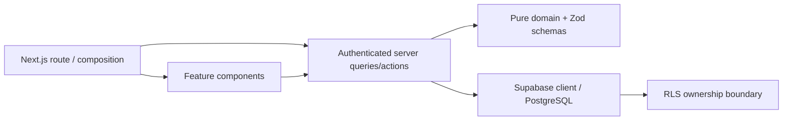

# Architecture

## Decision

Feature-based + lightweight Clean Architectureを採用する。

## Reasons

- RequirementsのItems / Review / Ideal / Expenses / Dashboardとコード所有範囲が一致する。
- 業務計算をReactやDBから独立してテストできる。
- App RouterのServer Component / Server Actionを活かし、不要なREST層を持たない。

## Trade-offs

- feature間の集計をDashboardが参照するため、完全な独立ではない。
- Repository interfaceは現時点では1実装しかなく、抽象化を追加しない。
- Supabase未接続では実データE2Eを完走できない。
- Production buildは、制限環境でも再現できる安定性を優先してWebpackを明示する。開発serverはNext.js既定のTurbopackを使う。

## Alternative

厳格なdomain/application/infrastructure/presentationの4層構成は依存方向をさらに明確にできるが、MVPではファイル数と変更コストが増えるため不採用。

## Item Color

Itemの色は表示名ではなく正規化した `#RRGGBB` を保存値とする。プリセットの名前はUI側の表示情報として管理し、同じ16進値をカラーパレットや直接入力でも扱えるようにする。これによりDB schemaを増やさず、一覧・詳細・編集で同じ色チップを再利用できる。

自由記述の色名を保存する代替案は、「青」の濃淡や言語表記が曖昧になり色チップを安全に描画できないため新規入力では採用しない。既存の非16進値は読取表示だけ維持し、次回編集時にプリセットまたは16進値への更新を促す。

## Update and Navigation Safety

Server Actionはサーバーで入力検証、再認証、所有者条件を確認し、完了までは対象フォームを `pending` として操作不能にする。成功前に表示値を確定させる楽観更新は、通信失敗時に保存済みと誤認する危険があるため採用しない。失敗はフォーム内へ返し、入力を保持したまま再試行できるようにする。

画面遷移はApp Shell配下の `loading.tsx` でナビゲーションを維持し、`useLinkStatus` で押したリンクにも固定幅の進捗を表示する。認証後に独立して実行できるDB readは `Promise.all` で開始し、カテゴリ取得後に本体取得を始めるwaterfallを作らない。

## Failure / Scale Review

- RLSなし: Data API経由で越境参照。全tableにRLS + ownership policy + `user_id` indexを必須化。
- Review部分成功: Itemとhistoryが不整合。単一DB functionで原子的に更新。
- Review履歴の直書き: transaction境界を迂回できる。table INSERTを拒否し、所有者検証済みの`review_item`だけに許可。
- `security definer`誤用: RLSを迂回する。Review履歴のappend-only保証に限定し、空の`search_path`、`auth.uid()`確認、最小grantを強制。代替のtrigger方式はMemo受け渡しと通常Status更新の区別が複雑になるため不採用。
- 大量Item: `%term%` 検索はscaleしない。MVP後に`pg_trgm` indexまたは検索専用列を検討。
- 年額端数: 月額表示のみroundし、集計はnumeric精度を維持。
- 任意URL: `javascript:` 等を拒否し、http/httpsのみ許可。
- 色入力: CSSとして解釈できる任意文字列をstyleへ渡すと表示崩れの原因になる。描画前にも16進値を検証し、無効な既存値は文字列だけを表示する。
- Review解除の誤認: `status = MAYBE` は明示依頼をOFFにしてもReview対象になる。Item詳細でこの条件を説明し、依頼フラグとReview対象判定を混同しない。
- 二重送信: 遅い更新中に再度submitすると、重複作成や後勝ち更新が起こりうる。対象フォームと競合操作をpending中は無効化する。
- 楽観更新の誤認: DB確定前の値を保存済みとして見せると、RLS拒否や通信断で表示と永続状態がずれる。更新中表示を使い、確定結果だけを反映する。
- read waterfall: カテゴリ取得を待ってからItem等を取得すると、ネットワーク往復時間が加算される。認証後の独立queryは並列に開始する。
