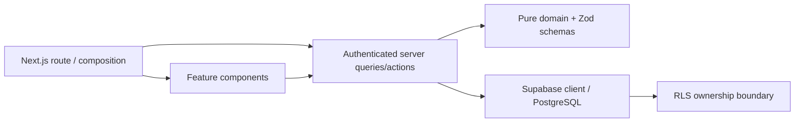

# Architecture

## Decision

Feature-based + lightweight Clean Architectureを採用する。

## Reasons

- RequirementsのItems / Review / Ideal / Expenses / Dashboardとコード所有範囲が一致する。
- 業務計算をReactやDBから独立してテストできる。
- App RouterのServer Component / Server Actionを活かし、不要なREST層を持たない。

## Trade-offs

- feature間の集計をDashboardが参照するため、完全な独立ではない。
- Repository interfaceは現時点では1実装しかなく、抽象化を追加しない。
- Supabase未接続では実データE2Eを完走できない。
- Production buildは、制限環境でも再現できる安定性を優先してWebpackを明示する。開発serverはNext.js既定のTurbopackを使う。

## Alternative

厳格なdomain/application/infrastructure/presentationの4層構成は依存方向をさらに明確にできるが、MVPではファイル数と変更コストが増えるため不採用。

## Failure / Scale Review

- RLSなし: Data API経由で越境参照。全tableにRLS + ownership policy + `user_id` indexを必須化。
- Review部分成功: Itemとhistoryが不整合。単一DB functionで原子的に更新。
- Review履歴の直書き: transaction境界を迂回できる。table INSERTを拒否し、所有者検証済みの`review_item`だけに許可。
- `security definer`誤用: RLSを迂回する。Review履歴のappend-only保証に限定し、空の`search_path`、`auth.uid()`確認、最小grantを強制。代替のtrigger方式はMemo受け渡しと通常Status更新の区別が複雑になるため不採用。
- 大量Item: `%term%` 検索はscaleしない。MVP後に`pg_trgm` indexまたは検索専用列を検討。
- 年額端数: 月額表示のみroundし、集計はnumeric精度を維持。
- 任意URL: `javascript:` 等を拒否し、http/httpsのみ許可。
