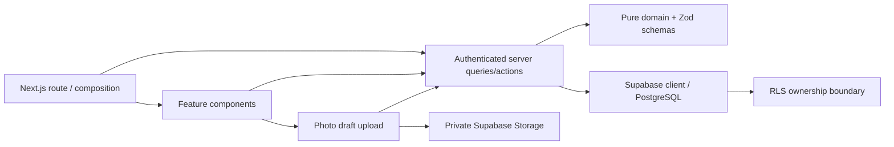
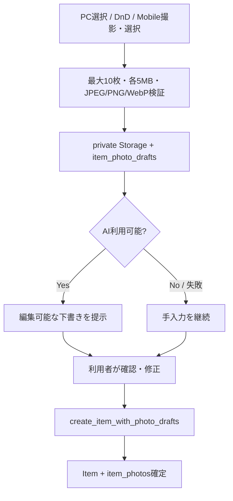

# Architecture

## Decision

Feature-based + lightweight Clean Architectureを採用する。

## Reasons

- RequirementsのItems / Review / Ideal / Expenses / Dashboardとコード所有範囲が一致する。
- 業務計算をReactやDBから独立してテストできる。
- App RouterのServer Component / Server Actionを活かし、不要なREST層を持たない。
- 写真binaryは非公開Storage、所有権・並び順・Itemとの関連はPostgreSQLに分け、各サービスに適した責務を持たせる。

## Trade-offs

- feature間の集計をDashboardが参照するため、完全な独立ではない。
- Repository interfaceは現時点では1実装しかなく、抽象化を追加しない。
- Supabase未接続では実データE2Eを完走できない。
- Production buildは、制限環境でも再現できる安定性を優先してWebpackを明示する。開発serverはNext.js既定のTurbopackを使う。
- 写真の先行uploadにより即時previewと再試行が可能になる一方、DB未確定のDraftを期限付きで回収する運用が必要になる。
- AI下書きは入力を速められる一方で誤認と外部処理への個人情報送信リスクがあるため、利用者確認前の自動保存は行わない。
- MVPでは原画像の再エンコードを行わないためEXIFが残りうる。保存・AI解析前の注意表示と、位置情報を下書き項目に利用しない制約を設け、EXIF除去は画質、Client CPU、依存追加を評価する次段の必須候補とする。

## Alternative

厳格なdomain/application/infrastructure/presentationの4層構成は依存方向をさらに明確にできるが、MVPではファイル数と変更コストが増えるため不採用。

写真をDBのbyte列へ保存する代替案はDB transactionだけで完結できるが、DB容量、配信性能、backup負荷が増えるため不採用。Itemを先に作ってStorageへ直接uploadする代替案はDraft管理を省けるが、upload中断時に利用者が確定していないItemを残すため不採用。

## Photo-first Registration

PCのfile picker / Drag & DropとMobileのcamera / photo pickerは、共通のPhoto Draft application flowへ正規化する。入力境界で枚数、byte size、Content-Typeを検証し、画像previewやAI提案を信頼済み値として扱わない。写真なしの既存Item登録と、AIなしの手入力を常に利用可能にする。

AI境界には画像を送る前に処理内容を明示し、AI providerの秘密鍵はServerだけで保持する。生成結果は外部入力としてZodで検証し、Category等の所有権・存在確認は保存時に改めて行う。AIが未設定または失敗してもPhoto Draftと手入力フォームを破棄しない。

Storageの追加・削除は公開クライアントへ許可せず、Route Handler内のservice role clientだけが実行する。`SUPABASE_SERVICE_ROLE_KEY` は `NEXT_PUBLIC_` を付けず、Cloudflareの暗号化secretとして保持する。期限切れDraftは `POST /api/item-photo-drafts/cleanup` をCloudflare Cronから少なくとも1時間ごとに実行して回収し、32文字以上の `ITEM_PHOTO_CLEANUP_SECRET` をBearer tokenとして要求する。

## Item Color

Itemの色は表示名ではなく正規化した `#RRGGBB` を保存値とする。プリセットの名前はUI側の表示情報として管理し、同じ16進値をカラーパレットや直接入力でも扱えるようにする。これによりDB schemaを増やさず、一覧・詳細・編集で同じ色チップを再利用できる。

自由記述の色名を保存する代替案は、「青」の濃淡や言語表記が曖昧になり色チップを安全に描画できないため新規入力では採用しない。既存の非16進値は読取表示だけ維持し、次回編集時にプリセットまたは16進値への更新を促す。

## Update and Navigation Safety

Server Actionはサーバーで入力検証、再認証、所有者条件を確認し、完了までは対象フォームを `pending` として操作不能にする。成功前に表示値を確定させる楽観更新は、通信失敗時に保存済みと誤認する危険があるため採用しない。失敗はフォーム内へ返し、入力を保持したまま再試行できるようにする。

画面遷移はApp Shell配下の `loading.tsx` でナビゲーションを維持し、`useLinkStatus` で押したリンクにも固定幅の進捗を表示する。認証後に独立して実行できるDB readは `Promise.all` で開始し、カテゴリ取得後に本体取得を始めるwaterfallを作らない。

## Failure / Scale Review

- RLSなし: Data API経由で越境参照。全tableにRLS + ownership policy + `user_id` indexを必須化。
- Review部分成功: Itemとhistoryが不整合。単一DB functionで原子的に更新。
- Review履歴の直書き: transaction境界を迂回できる。table INSERTを拒否し、所有者検証済みの`review_item`だけに許可。
- `security definer`誤用: RLSを迂回する。Review履歴のappend-only保証に限定し、空の`search_path`、`auth.uid()`確認、最小grantを強制。代替のtrigger方式はMemo受け渡しと通常Status更新の区別が複雑になるため不採用。
- 大量Item: `%term%` 検索はscaleしない。MVP後に`pg_trgm` indexまたは検索専用列を検討。
- 年額端数: 月額表示のみroundし、集計はnumeric精度を維持。
- 任意URL: `javascript:` 等を拒否し、http/httpsのみ許可。
- 色入力: CSSとして解釈できる任意文字列をstyleへ渡すと表示崩れの原因になる。描画前にも16進値を検証し、無効な既存値は文字列だけを表示する。
- Review解除の誤認: `status = MAYBE` は明示依頼をOFFにしてもReview対象になる。Item詳細でこの条件を説明し、依頼フラグとReview対象判定を混同しない。
- 写真の越境参照: private bucketだけでは所有権を保証しない。`storage.objects` と写真tableの両方で `auth.uid()`、bucket、所有者path、Item所有者を検証する。
- EXIF / 個人情報: 撮影位置、人物、住居内情報が含まれうる。MVPではEXIFが残りうることと外部AI送信を事前に説明し、位置情報を下書き項目に使わない。ログやエラーへ画像・signed URLを出さない。再エンコードによるEXIF除去は次段で必須候補として評価する。
- 巨大・偽装file: Client申告の拡張子やMIMEを信用せず、最大10枚・各5MB・JPEG/PNG/WebPをServer / Storageでも強制する。画像decoderの処理量にも上限を設ける。
- AI誤認: 下書きを確定値として保存せず、利用者の確認・修正と明示的なsubmitを必須にする。Category所有権等は通常入力と同じServer検証を通す。
- 中断Draft: Storage upload後に画面を閉じるとorphan objectが残る。期限付きcleanupと所有者限定の再開・削除を用意し、cleanupと保存の競合はrow lockまたは状態条件で防ぐ。
- 写真付きItemの部分成功: StorageとPostgresは同一transactionにならない。先行Draftを作り、Item作成とDraft紐付けをDB RPCで原子的に確定し、失敗時はDraftのまま保持または補償削除する。
- 二重送信: 遅い更新中に再度submitすると、重複作成や後勝ち更新が起こりうる。対象フォームと競合操作をpending中は無効化する。
- 楽観更新の誤認: DB確定前の値を保存済みとして見せると、RLS拒否や通信断で表示と永続状態がずれる。更新中表示を使い、確定結果だけを反映する。
- read waterfall: カテゴリ取得を待ってからItem等を取得すると、ネットワーク往復時間が加算される。認証後の独立queryは並列に開始する。
