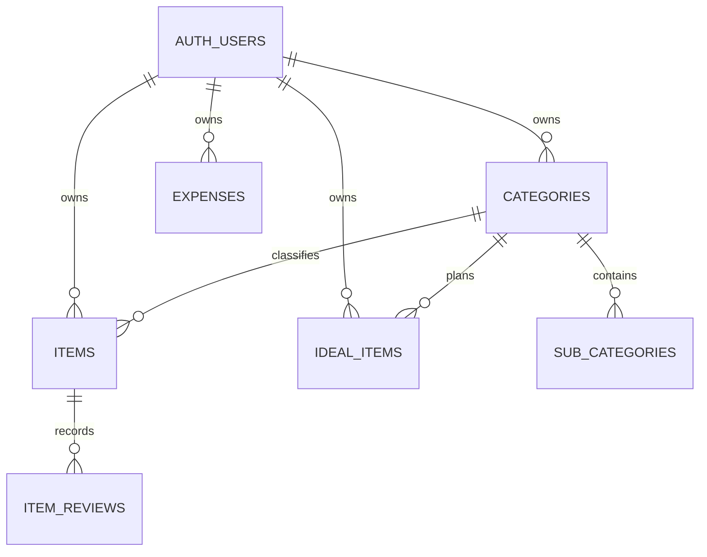

# Database Design

## Aggregates

- Category aggregate: `categories` と `sub_categories`。
- Item aggregate: `items`。`item_reviews` はappend-only history。
- Ideal aggregate: `ideal_items`。
- Expense aggregate: `expenses`。

全tableはUUID PK、`user_id -> auth.users(id) on delete cascade`、timestampsを持つ。検索・RLS対象列にindexを置く。

Review decisionのみ複数table更新を伴うため、`review_item` DB functionをtransaction boundaryとする。関数はinvoker権限でRLSを維持する。
