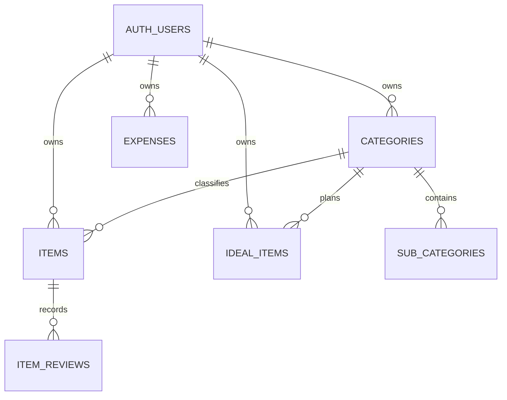

# Database Design

## Aggregates

- Category aggregate: `categories` と `sub_categories`。
- Item aggregate: `items`。`item_reviews` はappend-only history。
- Ideal aggregate: `ideal_items`。
- Expense aggregate: `expenses`。

全tableはUUID PK、`user_id -> auth.users(id) on delete cascade`、timestampsを持つ。検索・RLS対象列にindexを置く。

Review decisionのみ複数table更新を伴うため、`review_item` DB functionをtransaction boundaryとする。Review履歴への直接INSERTは拒否し、関数だけが書き込める。関数は`security definer`だが、`search_path`を空に固定し、`auth.uid()`による所有者確認、最小のEXECUTE grant、行lockを必須とする。

Review session UUIDを境界とし、対象はSource of Truthどおり「明示的にrequestされたItem」または「MAYBE Item」とする。同一session内で既に判断したItemだけ履歴のsession IDで除外するため、MAYBE決定後の即時ループを防ぎつつ、新しいReview sessionでは再び対象になる。RPCは行lock後にも対象性を再確認し、`(user, session, item)`の一意制約と冪等returnで二重送信による履歴重複を防ぐ。時刻比較案はapp / DB間のclock skewで境界が不安定になるため不採用。
