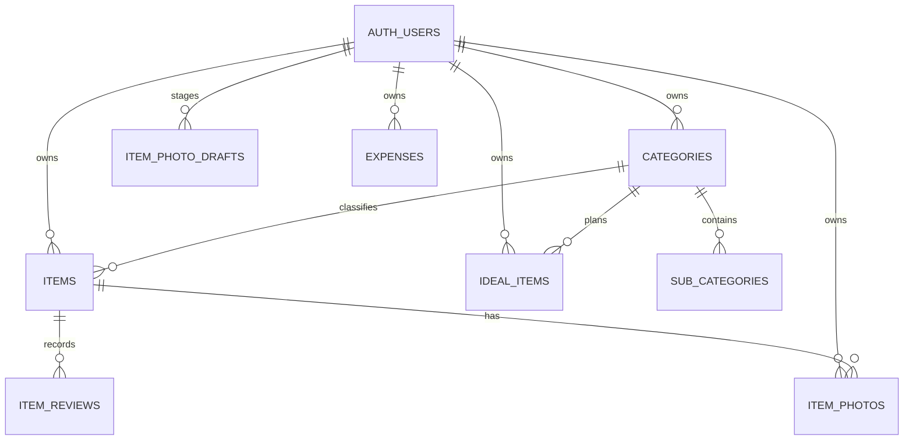
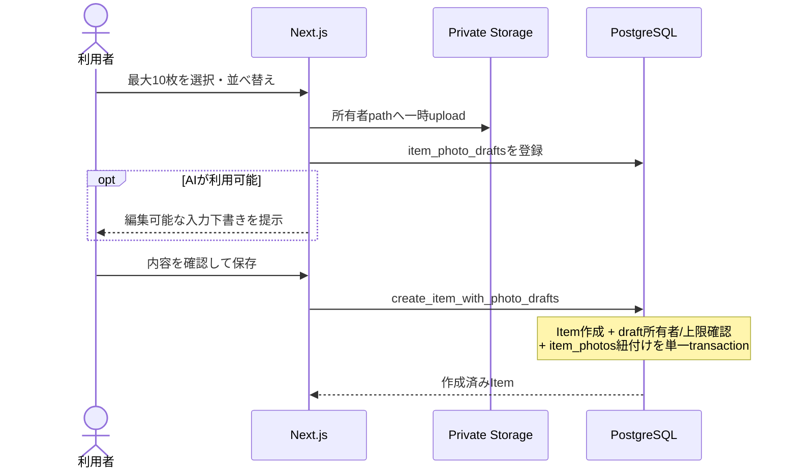

# Database Design

## Aggregates

- Category aggregate: `categories` と `sub_categories`。
- Item aggregate: `items`。`item_reviews` はappend-only history。
- Item Photo staging: `item_photo_drafts`。Item確定前のStorage objectと所有者・並び順を管理する。
- Item Photo aggregate member: `item_photos`。確定済みItemと非公開Storage objectを紐づける。
- Ideal aggregate: `ideal_items`。
- Expense aggregate: `expenses`。

全tableはUUID PK、`user_id -> auth.users(id) on delete cascade`、timestampsを持つ。検索・RLS対象列にindexを置く。

Review decisionのみ複数table更新を伴うため、`review_item` DB functionをtransaction boundaryとする。Review履歴への直接INSERTは拒否し、関数だけが書き込める。関数は`security definer`だが、`search_path`を空に固定し、`auth.uid()`による所有者確認、最小のEXECUTE grant、行lockを必須とする。

Review session UUIDを境界とし、対象はSource of Truthどおり「明示的にrequestされたItem」または「MAYBE Item」とする。同一session内で既に判断したItemだけ履歴のsession IDで除外するため、MAYBE決定後の即時ループを防ぎつつ、新しいReview sessionでは再び対象になる。RPCは行lock後にも対象性を再確認し、`(user, session, item)`の一意制約と冪等returnで二重送信による履歴重複を防ぐ。時刻比較案はapp / DB間のclock skewで境界が不安定になるため不採用。

## Item Photo Storage and Transaction Boundary

`item-photos` bucketは非公開とし、公開URLを利用しない。Storage objectのpathは推測困難な識別子を使い、先頭segmentのユーザーIDと `auth.uid()` が一致する所有者RLSを `storage.objects` に設定する。DB側の `item_photo_drafts` / `item_photos` にも `user_id` を保持し、全操作でItem、写真行、Storage pathの所有者一致を強制する。画像取得は認証済みdownloadまたは短時間のsigned URLに限定する。

1件のItemに紐づく写真は最大10枚とし、並び順を重複なく保持する。最小の並び順を代表写真とし、代表写真専用の重複状態を持たない。許可するContent-TypeはJPEG / PNG / WebP、byte sizeは1枚5MB以下であり、Client検証に加えてStorage bucket制約とServer境界でも拒否する。拡張子やClient申告だけを信頼せず、upload前にfile signatureを検証する。

新規Itemは `create_item_with_photo_drafts`、既存Itemへの追加は `attach_item_photo_drafts` をDB transaction boundaryとする。どちらも `auth.uid()` を再確認し、他ユーザーのItem / Draft、既に消費済みのDraft、上限超過を拒否する。Storage uploadはPostgres transactionへ含められないため先行処理とし、RPC失敗時にItemだけまたは写真行だけが確定しないようにする。中断・失敗したDraftとobjectは24時間の期限を持たせ、private削除queueを介した定期cleanupで回収する。

AI解析は `claim_item_photo_draft_analysis` で行lockとユーザー単位advisory lockを取得してから開始する。同一Draftは最大2回、ユーザーは直近1時間20回までとし、処理中の重複解析・Itemへの紐付け・削除を拒否する。5分以上応答しないclaimはstaleとして再試行可能にする。確定写真と有効Draftの合計はユーザーあたり500枚までとし、並行作成でもRPC内のlockで上限を超えない。

代替案としてItemを先に作成して写真を1枚ずつ直接紐づける方法は実装が単純だが、途中失敗で「写真なしItem」や一部写真だけの確定が発生するため採用しない。StorageとDBを完全に同一transactionへ含めることはできないため、Draft stagingと補償cleanupを採用する。
