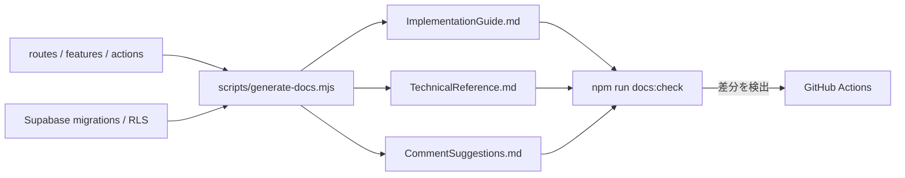

# 開発者向けドキュメント生成

## 目的

ソースコードとmigrationから、実装調査やレビューの入口になる技術ドキュメントを再現可能に生成する。手作業で転記する量を減らし、実装変更に対して資料が古くなったことをCIで検出する。

生成物は `docs/generated` にGit管理され、次の3ファイルで構成される。

- `ImplementationGuide.md`: route、feature、server actionの実装案内
- `TechnicalReference.md`: 公開symbol、migration、RLS、security boundaryの技術リファレンス
- `CommentSuggestions.md`: JSDocが不足している公開symbolとコメント候補

`CommentSuggestions.md` はレビュー材料であり、生成処理がソースコードへコメントを自動挿入することはない。

## 使い方

Node.js 22以上と、リポジトリの依存関係を準備する。

```bash
npm ci
npm run docs:generate
```

生成後は `docs/generated` の差分を確認する。誤った説明や不要な公開APIが見つかった場合は、生成物だけを手で直さず、ソースコードまたは生成処理を修正して再生成する。

生成済みファイルが現在のソースコードと一致するかだけを確認する場合は、次を実行する。このコマンドはファイルを書き換えず、不一致があれば失敗する。

```bash
npm run docs:check
```

通常の品質確認にも同じ検査が含まれる。

```bash
npm run check
```

CIで失敗した場合は、ローカルで `npm run docs:generate` を実行し、生成差分が実装変更を正しく説明していることをレビューしてからcommitする。

## 設計



生成処理はソースコードを読み取り、出力先を `docs/generated` に限定する。`--check` は同じ入力から期待内容を組み立て、Git管理された生成物と比較する。アプリの実行時には呼び出さず、ドキュメント生成を業務処理やSupabaseへの副作用から分離する。

### 設計理由

- 生成物をGit管理することで、GitHub上のコードレビューやオフラインの調査でも参照できる。
- 生成と鮮度確認に同じエンジンを使い、ローカルとCIの判定差を避ける。
- `npm run check` に鮮度確認を含め、実装変更時の確認漏れを品質ゲートで検知する。
- コメントは提案に留め、意図を理解しない自動書換えや不要なJSDocの増加を防ぐ。

### トランザクション・権限境界

生成処理はローカルファイルの静的解析のみを行う。Supabase接続、認証情報、外部ネットワーク、DB transactionを必要としない。生成結果に記載されたRLSやserver actionの説明は参照情報であり、実際の認可境界はmigration、server-side認証、RLS policyが担う。

## トレードオフ

- Git管理するため生成差分がcommit量を増やす一方、PRで実装と資料を同時にレビューできる。
- 静的解析は構造を再現しやすい一方、業務上の意図やruntimeの分岐を完全には説明できない。
- `npm run check` の時間がわずかに増える一方、古いドキュメントのmergeを早期に防げる。
- コメントを自動挿入しないため採用は手作業になる一方、公開symbolの意味を人が確認するレビュー境界を維持できる。

代替案として生成物をCI artifactだけに保存する方法がある。リポジトリ差分は減るが、通常のコードレビューやローカル参照が難しく、main branch上の資料へ安定してリンクできないため採用しない。

## 危険ケースとレビュー観点

- **秘密情報の混入**: コード、fixture、コメントに秘密情報を置かない。生成差分にもtoken、cookie、個人情報がないことを確認する。
- **誤った安心感**: 生成文書をSource of Truthやセキュリティ検査の代替にしない。仕様は `Requirements.md`、DB定義とRLSはmigrationを優先する。
- **手修正の消失**: `docs/generated` を直接編集しても次回生成で上書きされる。恒久修正はソースまたは生成処理へ行う。
- **不安定な出力**: 実行時刻、環境依存の絶対path、走査順の揺れを出力へ含めるとCIが継続的に失敗する。生成結果は決定的であることを保つ。
- **公開範囲の誤認**: exported symbolであることと、外部利用を保証する公開APIであることは同義ではない。コメント候補の採用前にfeature境界を確認する。
- **規模拡大**: ファイル数が増えて鮮度確認が遅くなった場合は、入力範囲の明示や解析結果のcacheを検討する。ただし差分検出を部分的にして取りこぼす最適化は行わない。
- **Markdownの安全性**: ソース由来の文字列をHTMLとして信頼しない。生成物を別システムへ公開する場合は、そのrenderer側でも危険なHTMLやURLを無効化する。

生成物のレビューでは、routeとfeatureの対応、mutationの認証再確認、Zodによる入力検証、RLSとtransaction boundary、URL安全性を必ず確認する。
