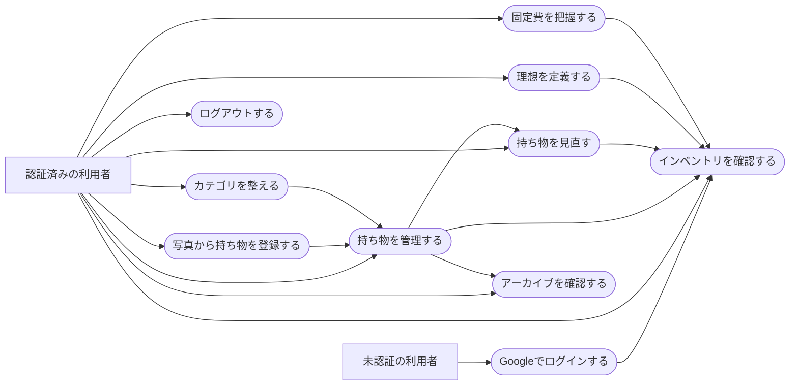

# Life Inventory MVP 手動受入チェックリスト

## 目的

この文書は、`docs/Requirements.md` と `docs/UseCases.md` を基準に、MVPの基本機能を利用者の操作として確認するためのチェックリストである。仕様にない機能は合格条件へ追加しない。現在の実装と仕様の差異は末尾の「既知の差異・受入時の注意」に分けて記載する。

## 記録方法

- 未実施は `[ ]`、合格は `[x]`、不合格は `[NG]`、環境都合で実施できない場合は `[保留]` と記録する。
- 不合格または保留には、確認日時、ブラウザ、画面幅、操作、期待結果、実際の結果を添える。
- 個人情報や秘密情報をスクリーンショット、Issue、ログへ残さない。
- 受入データは本番データと混ぜず、専用ユーザーまたは検証用プロジェクトを使う。カテゴリと持ち物はUIから完全削除できないため、検証用ユーザーの利用を推奨する。

## ユースケース図

## 対象画面

| 機能                         | パス                                                            | 認証 |
| ---------------------------- | --------------------------------------------------------------- | ---- |
| Googleログイン               | `/login`、`/auth/callback`                                      | 不要 |
| インベントリ                 | `/dashboard`                                                    | 必要 |
| 持ち物一覧・追加・詳細・編集 | `/items`、`/items/new`、`/items/:itemId`、`/items/:itemId/edit` | 必要 |
| 見直し                       | `/review`                                                       | 必要 |
| 理想                         | `/ideal`                                                        | 必要 |
| 固定費                       | `/expenses`                                                     | 必要 |
| カテゴリ                     | `/settings/categories`                                          | 必要 |
| アーカイブ                   | `/archive`                                                      | 必要 |

## 前提条件

- [ ] 対象ブランチの依存関係がインストールされ、アプリが起動している。
- [ ] Supabaseのmigrationが適用され、Google OAuth Provider、Site URL、Redirect URLが対象環境に設定されている。
- [ ] 非公開Storage bucket `item-photos` とStorage RLSが適用されている。AIあり・AI未設定の両方を確認する場合は環境を分けて記録する。
- [ ] `SUPABASE_SERVICE_ROLE_KEY` と32文字以上の `ITEM_PHOTO_CLEANUP_SECRET` がserver-only secretとして設定され、Cloudflare Cronから期限切れDraftのcleanup APIを少なくとも1時間ごとに実行できる。
- [ ] Googleログインに使える検証用アカウントがある。
- [ ] RLSのユーザー分離確認を行う場合は、互いにデータを持たないGoogleアカウントを2つ用意する。
- [ ] ブラウザの開発者ツールでConsole、Network、レスポンシブ表示を確認できる。
- [ ] Desktop、Tablet、Mobile相当の表示環境を用意する。特定の画面幅は仕様で固定されていないため、実際に利用する代表端末を記録する。
- [ ] 初期状態と操作後の差分を確認できるよう、インベントリの数量、見直し件数、理想数量、固定費を操作前に記録する。

## 正常系

### 1. Googleログイン

- [ ] 未認証で `/dashboard` を開くと `/login` へ移動する。
- [ ] ログイン画面の認証導線が「Googleで続ける」の1つだけで、Email / Passwordの入力欄がない。
- [ ] 「Googleで続ける」を押すと処理中表示になり、重複操作できない。
- [ ] Googleで認証すると `/dashboard` へ戻り、認証済み画面が表示される。
- [ ] 初回のGoogle認証でも同じ導線で利用を開始できる。
- [ ] Gmail本文や連絡先へのアクセス許可を求めず、基本プロフィールとメールアドレスの範囲に留まる。

### 2. インベントリ

- [ ] `/dashboard` の画面タイトルとナビゲーション名が「インベントリ」で統一されている。
- [ ] 「今の持ち物」は、アーカイブされていない持ち物の行数ではなく数量の合計を表示する。
- [ ] 「理想の持ち物」は理想数量の合計を表示する。
- [ ] 「差」は `理想の数量 - 今の数量` と一致し、正数には `+` が付く。
- [ ] 見直し待ち件数は「状態が迷っている」または「見直し依頼がON」のアクティブな持ち物と一致する。
- [ ] 手放す予定の数量は、状態が「手放す」のアクティブな持ち物の数量合計と一致する。
- [ ] カテゴリ別の数量はアクティブな持ち物の数量合計と一致する。
- [ ] 月額・年額固定費が固定費画面の集計と一致する。
- [ ] 各カードまたはリンクから、持ち物、見直し、理想、固定費へ移動できる。
- [ ] データがない初期状態でも0件表示が崩れず、操作可能な画面へ移動できる。

### 3. カテゴリ

- [ ] カテゴリが一件もない初回利用時に、「衣」「食」「住」「趣」「仕」がそのユーザー専用の初期カテゴリとして用意される。
- [ ] 任意の名前でカテゴリを追加できる。
- [ ] 「おすすめカテゴリ」は未登録の候補だけを表示し、必要な候補を個別に追加できる。
- [ ] カテゴリ名を更新すると、紐づく持ち物のカテゴリ表示にも反映される。
- [ ] 各カテゴリにサブカテゴリを追加できる。
- [ ] サブカテゴリ名を更新できる。
- [ ] 同じカテゴリ名を重複登録しようとすると保存されず、フォーム付近にエラーが表示される。
- [ ] 同一カテゴリ内で同じサブカテゴリ名を重複登録しようとすると保存されず、フォーム付近にエラーが表示される。
- [ ] 保存中は対象ボタンが無効になり、「追加中…」「更新中…」など処理内容が分かる。

### 4. 持ち物

#### 4.1 追加

- [ ] `/items/new` で、名前、カテゴリ、数量の3項目だけを入力して持ち物を追加できる。
- [ ] 新規追加時の既定数量は1、既定状態は「残す」である。
- [ ] 「詳細情報を開く」は展開操作だと文言と下向き矢印から判別でき、開くと「詳細情報を閉じる」へ変わる。
- [ ] 詳細項目がすべて任意で、後から更新できる旨が表示される。
- [ ] サブカテゴリ、色、サイズ、用途、商品ページURL、購入価格、購入日、最終使用日、状態、見直し依頼、メモを任意で保存できる。
- [ ] 色は未設定、プリセット、カラーパレット、16進入力から選択でき、保存後は同じ色が詳細・一覧に表示される。
- [ ] 「見直しに追加」をONにして保存すると、その持ち物が見直し対象になる。
- [ ] 保存中はボタンが無効になり、「持ち物を保存中…」と表示される。
- [ ] 保存後は作成した持ち物の詳細画面へ移動する。

#### 4.2 写真起点の追加

- [ ] PCで画像選択とDrag & Dropのどちらからも写真を追加できる。
- [ ] Mobileでカメラ撮影と既存画像の選択のどちらからも写真を追加できる。
- [ ] JPEG、PNG、WebPを合計10枚まで追加でき、選択した写真のpreviewを確認できる。
- [ ] 写真を並べ替えて保存すると、先頭の写真が一覧と詳細の代表写真になる。
- [ ] 写真を使わず、従来どおり名前・カテゴリ・数量を手入力して登録できる。
- [ ] AIが設定された環境では、写真から生成した入力下書きが未確定の提案として表示され、保存前に修正できる。
- [ ] AI提案は確認操作だけでは保存されず、利用者が明示的に保存した後にItemへ反映される。
- [ ] AIが未設定または生成に失敗しても、エラー内容と手入力導線が表示され、登録を継続できる。
- [ ] 写真付きで保存すると、Itemと全写真の紐付けが一緒に確定し、詳細画面に並び順どおり表示される。
- [ ] 保存中は重複操作できず、処理中であることを文言または支援技術向け属性で判別できる。

#### 4.3 一覧・検索・絞り込み

- [ ] `/items` にアーカイブされていない持ち物だけが表示される。
- [ ] 一覧上部の個数が、表示中の持ち物の数量合計と一致する。
- [ ] 名前の一部で検索できる。
- [ ] 用途の一部で検索できる。
- [ ] メモの一部で検索できる。
- [ ] カテゴリで絞り込める。
- [ ] 状態の「残す」「迷っている」「手放す」で絞り込める。
- [ ] 検索・カテゴリ・状態を組み合わせても、すべての条件に合う結果だけが表示される。
- [ ] 0件の場合に空状態と「持ち物を追加」導線が表示される。
- [ ] 一覧の行から持ち物詳細へ移動できる。

#### 4.4 詳細・編集・状態

- [ ] 詳細画面にカテゴリ、数量と保存済みの任意項目が表示される。
- [ ] 商品ページURLがある場合、新しいタブで開き、開いたページから元画面を操作できない設定になっている。
- [ ] 「編集」から既存値入りのフォームを開き、変更を保存できる。
- [ ] 状態を「残す」「迷っている」「手放す」へ変更でき、一覧とインベントリへ反映される。
- [ ] 詳細画面から見直し依頼を追加・解除できる。
- [ ] 状態が「迷っている」の場合、見直し依頼を解除しても見直し対象のままであることが説明・動作とも一致する。

### 5. 見直し

- [ ] 状態が「迷っている」または見直し依頼がONのアクティブな持ち物だけが対象になる。
- [ ] 対象を1件ずつ表示し、カテゴリ、名前、数量、最終使用日、残り件数を確認できる。
- [ ] 任意のメモを入力し、「残す」「保留」「手放す」のいずれかを選べる。
- [ ] 判断の保存中は3つの判断ボタンが無効になり、保存中表示が出る。
- [ ] 判断後は同じセッションの次の対象へ進み、同じ持ち物が即座に再表示されない。
- [ ] 「保留」にした持ち物は同じセッションでは再表示されず、新しい見直しセッションでは再び対象になる。
- [ ] 完了時に今回の合計、残す、保留、手放すの件数が一致する。
- [ ] 対象がない場合に完了メッセージと持ち物一覧への導線が表示される。
- [ ] 「手放す」は状態を更新する判断であり、自動的なアーカイブではない。アーカイブは持ち物詳細から別途行う。

### 6. 理想

- [ ] 「理想の持ち物の入力欄を開く」は展開操作だと判別でき、開閉に応じて文言と矢印が変わる。
- [ ] 名前、カテゴリ、理想の数量を入力して理想の持ち物を追加できる。
- [ ] 理想数量0を「持たない状態」として登録できる。
- [ ] 想定価格、優先度、メモを任意で保存できる。
- [ ] 同じカテゴリかつ同じ名前のアクティブな持ち物の数量が「現在」として集計される。
- [ ] 差が `理想の数量 - 現在の数量` と一致する。
- [ ] 「すべて」「減らす」「増やす」「一致」の絞り込み結果が差の符号と一致する。
- [ ] 各行の「編集フォームを開く」から既存値を更新できる。
- [ ] 理想の持ち物を削除すると一覧とインベントリの集計から除外される。
- [ ] 同一ユーザー・同一カテゴリ・同一名の理想を重複登録しようとすると保存されない。

### 7. 固定費

- [ ] 「固定費の入力欄を開く」は展開操作だと判別でき、開閉に応じて文言と矢印が変わる。
- [ ] 名前、カテゴリ、金額、支払い周期を入力して固定費を追加できる。
- [ ] カテゴリは住居費、水道光熱費、通信費、サブスクリプション、返済、その他から選べる。
- [ ] 毎月の固定費は月額に入力金額、年額に入力金額の12倍として加算される。
- [ ] 毎年の固定費は年額に入力金額、月額に入力金額の12分の1として加算される。
- [ ] 例として毎月1,200円と毎年12,000円だけを登録した場合、月額2,200円、年額26,400円になる。
- [ ] 毎年を選んだ場合、任意の支払い月1〜12を保存・表示できる。
- [ ] メモを任意で保存できる。
- [ ] カテゴリ別に固定費が表示される。
- [ ] 「編集・削除を開く」から既存値を更新できる。
- [ ] 固定費を削除すると一覧とインベントリの集計から除外される。

### 8. アーカイブ

- [ ] アクティブな持ち物の詳細で「アーカイブ入力欄を開く」と、任意の手放す理由とアーカイブ操作が表示される。
- [ ] アーカイブすると持ち物一覧から除外され、`/archive` へ移動する。
- [ ] アーカイブ画面に名前、数量、カテゴリ、日付、購入価格、入力した理由が表示される。
- [ ] アーカイブした数量がインベントリの今の持ち物、差、カテゴリ別、見直し待ち、手放す予定から除外される。
- [ ] アーカイブした持ち物は物理削除されず、記録として残る。

### 9. ログアウト

- [ ] Desktopのサイドバーで、ログアウトがアイコン付きの赤い操作として表示される。
- [ ] ログアウト中は操作が無効になり、「ログアウト中…」と表示される。
- [ ] ログアウト後は `/login` へ移動する。
- [ ] ログアウト後に戻る操作またはURL直入力で認証必須画面を開いても、内容が表示されず `/login` へ移動する。

## 異常系・安全系

### 入力検証

- [ ] 持ち物の名前を空、数量を0・小数・1,000,001超にすると保存されず、該当項目にエラーが表示される。
- [ ] 持ち物の商品ページURLに `javascript:`、`data:`、不完全なURLを入力すると保存されない。
- [ ] 持ち物の購入価格、理想の想定価格、固定費の金額に負数または小数を入力すると保存されない。
- [ ] 理想の数量に負数または小数を入力すると保存されない。
- [ ] 固定費の支払い月に0、13、小数を入力すると保存されない。
- [ ] カテゴリ・サブカテゴリ名を空または51文字以上にすると保存されない。
- [ ] 名前やメモへHTMLタグ相当の文字列を入力しても、詳細・一覧では文字として表示され、スクリプトが実行されない。
- [ ] 不正な検索・filter queryをURLへ指定しても、例外画面にならず安全な既定値として扱われる。
- [ ] 5MBを超える画像、JPEG / PNG / WebP以外、11枚目以降の画像はuploadされず、制限と修正方法が表示される。
- [ ] 拡張子だけを `.jpg` 等へ変更した非画像fileが、画像として保存されない。
- [ ] 撮影写真に位置情報・人物・住居内情報等が含まれうることと、設定時は外部AI解析へ送信することが、保存・解析前に表示される。
- [ ] EXIFの位置情報がItem名、カテゴリ、用途、メモ等のAI下書き項目へ反映されない。

### 通信失敗・重複操作

- [ ] DevToolsで通信をOfflineにして保存すると、成功したように見えず、再試行のためのエラーが確認できる。
- [ ] 保存失敗後も入力値が維持されることを、持ち物、理想、固定費、カテゴリで確認する。
- [ ] 送信中に同じ保存操作を連打しても、重複データが作られない。
- [ ] 見直し判断を素早く複数回操作しても、同じセッション・同じ持ち物の履歴が重複せず、状態と履歴が不整合にならない。
- [ ] Google認証を中断・失敗した場合、ログイン画面へ戻り、再試行可能なエラーが表示される。
- [ ] AI生成を失敗させても写真と手入力済みの内容が可能な範囲で維持され、手入力で保存できる。
- [ ] 写真upload後・Item保存前に画面を閉じてもItemは作成されず、Draftが他ユーザーへ公開されない。再開または期限後cleanupの挙動を確認する。
- [ ] 写真付き新規Itemの保存を途中で失敗させても、新規Itemだけまたは一部の写真紐付けだけがDBへ確定しない。

### 認証・認可

- [ ] 未認証状態では、すべての認証必須パスがログインへ誘導される。
- [ ] 存在しない持ち物IDを開くと、他データを表示せずNot Foundになる。
- [ ] 2アカウントで確認できる場合、アカウントAの持ち物URLをアカウントBで直接開いても内容を参照・更新できない。
- [ ] 2アカウントで確認できる場合、カテゴリ、持ち物、見直し履歴、理想、固定費、アーカイブの件数が混ざらない。
- [ ] 2アカウントで確認できる場合、アカウントAの写真object path、Draft ID、Item Photo IDをアカウントBから指定しても、一覧・取得・紐付け・削除できない。
- [ ] 非公開bucketのobject URLを未認証状態で直接開いても写真を取得できず、signed URLを使う場合は期限後に無効になる。
- [ ] ブラウザのConsole、Networkレスポンス、画面上のエラーに秘密情報、SQL、他ユーザーの識別情報が表示されない。
- [ ] Console、Server log、エラー監視へ画像binary、EXIF、永続利用できるsigned URL、AI providerの秘密鍵が出力されない。

## レスポンシブ表示

### Desktop

- [ ] サイドバー、本文、フォーム、カードが重ならず、意図しない横スクロールがない。
- [ ] サイドバー境界へポインターを合わせても記号やハンドルは表示されず、`col-resize` カーソルだけでリサイズ可能だと分かる。
- [ ] 境界をドラッグするとサイドバー幅が変わり、最小幅ではナビゲーションがアイコンのみになる。
- [ ] 境界をクリックすると展開・折りたたみを切り替えられる。
- [ ] 折りたたみ時も各アイコンのツールチップまたはアクセシブル名から機能を判別できる。

### Tablet / Mobile

- [ ] Tablet相当の縦横表示で、入力欄とボタンの文字が不自然に縦書きにならず、タップ領域が重ならない。
- [ ] Mobile相当では下部ナビゲーションが表示され、インベントリ、持ち物、見直し、理想、固定費へ移動できる。
- [ ] Mobile相当でフォーム、絞り込み、カードに意図しない横スクロールや画面外にはみ出す操作がない。
- [ ] Mobileのカメラ撮影から戻った後もpreview、削除、並べ替え、手入力、保存へ到達できる。
- [ ] ソフトウェアキーボード表示中も、入力中の項目と保存操作へ到達できる。
- [ ] 端末の文字サイズ拡大またはブラウザ200% Zoomでも、内容や操作が欠落しない。

## アクセシビリティ

- [ ] マウスを使わず、Tab / Shift+Tabで主要ナビゲーション、フォーム、展開操作、保存操作へ移動できる。
- [ ] キーボードFocusが常に視覚的に確認できる。
- [ ] `details` の開閉をEnterまたはSpaceで操作でき、開閉状態を支援技術が認識できる。
- [ ] サイドバー境界をEnter / Spaceで開閉、左右矢印でリサイズ、Homeで折りたためる。
- [ ] すべての入力欄にラベルまたはアクセシブル名があり、エラーが対象項目と関連付けられている。
- [ ] アイコンだけになるサイドバー操作と視覚的アイコンに、意味の分かるアクセシブル名がある。
- [ ] 保存中の無効状態と進行状況を、色だけでなく文言または支援技術向け属性でも判別できる。
- [ ] 写真の追加、削除、並べ替え操作に意味の分かるアクセシブル名があり、キーボードでも並び順を変更できる。
- [ ] エラーが `role="alert"` などで通知され、色だけに依存しない。
- [ ] 通常文字、補助文字、Focus、破壊的操作のコントラストが実際の背景に対して十分である。
- [ ] OSの「視差効果を減らす」を有効にした場合、不要なアニメーションが抑制される。

## 非機能・観察項目

- [ ] 通常データ量でインベントリと持ち物一覧がおおむね1秒以内に利用可能になる。測定条件と件数を記録する。
- [ ] 画面遷移中もApp Shellが維持され、押したナビゲーションと遷移先領域に待機状態が表示される。
- [ ] 空状態、読込中、Not Found、予期しないエラーの各表示から、利用者が次の行動を判断できる。
- [ ] 日本語UI内で、Google、URL、KEEP等の保存値を除く不要な英語表記が混在しない。
- [ ] 数量、金額、差、件数の数字が画面間で同じ数字用フォントと桁スタイルを使う。

## 既知の差異・受入時の注意

以下はこの文書作成時点の仕様と実装の差異であり、チェック漏れではない。

1. **カテゴリ削除:** Requirementsには「紐づくItemがあるCategoryは削除しない」とあるが、現行UIとServer Actionにはカテゴリ・サブカテゴリの削除操作がない。紐づきのないカテゴリを削除する受入項目は現状実施できない。
2. **Mobileの補助導線:** Mobileの下部ナビゲーションはインベントリ、持ち物、見直し、理想、固定費の5つだけで、アーカイブ、カテゴリ設定、ログアウトへの導線が表示されない。URL直入力を前提にせず、Mobileで到達可能にする必要がある。
3. **破壊的操作の失敗表示:** 理想・固定費の削除とアーカイブは、失敗時に対象フォーム内の再試行可能なエラーではなく、例外処理へ進む実装である。Requirementsの失敗時UXを満たすか別途確認・改善が必要である。
4. **カテゴリプリセット:** 初回の5カテゴリと「おすすめカテゴリ」は実装されているが、プリセット内容自体はRequirements / UseCasesに定義されていない。内容の妥当性は受入合否ではなく、プロダクト判断として扱う。
5. **見直し履歴:** 判断履歴は保存されるが、履歴一覧を閲覧する画面はない。Requirementsは履歴保存を求めているが、履歴表示は明記していない。
6. **アーカイブ復元:** 復元操作は実装されていないが、Requirementsにも復元要件はないためMVPの不合格条件にはしない。
7. **配色:** RequirementsのPrimaryは `#89916B` だが、現行CSSのPrimaryは `#737B55` である。意図したコントラスト調整か、仕様逸脱かを決定する必要がある。
8. **件数上限:** 持ち物一覧・アーカイブ・見直し・インベントリ集計には取得上限がある。通常データ量のMVPでは許容できるが、上限を超えると表示・集計が全件を表さない可能性がある。
9. **ドキュメント生成:** 現行Requirements / UseCasesとアプリroutesには、利用者向けドキュメント生成のユースケースが定義されていないため、このアプリ手動受入の合格条件には含めていない。
10. **写真起点登録:** Requirements / UseCasesへ追加済みだが、受入時はmigration、非公開Storage RLS、Draft cleanup、AI設定有無を含む実装完了を確認する。Storage uploadはPostgres transaction外のため、DBの原子性だけでなく中断objectの補償処理も確認対象とする。
11. **写真のEXIF:** MVPでは原画像を再エンコードしないため位置情報等のEXIFがStorageやAI providerへ送られうる。注意表示と「位置情報を下書き項目に利用しない」制約を確認し、EXIF除去は画質・Client CPU・依存追加を評価したうえで次段の必須候補とする。

## 受入結果

| 項目                    | 記録                         |
| ----------------------- | ---------------------------- |
| 実施日時                |                              |
| 対象commit              |                              |
| 環境 / Supabase project |                              |
| ブラウザ / OS           |                              |
| Desktop画面幅           |                              |
| Tablet画面幅            |                              |
| Mobile画面幅            |                              |
| 合格件数                |                              |
| 不合格件数              |                              |
| 保留件数                |                              |
| 判定                    | 合格 / 条件付き合格 / 不合格 |
| 備考・Issue             |                              |
