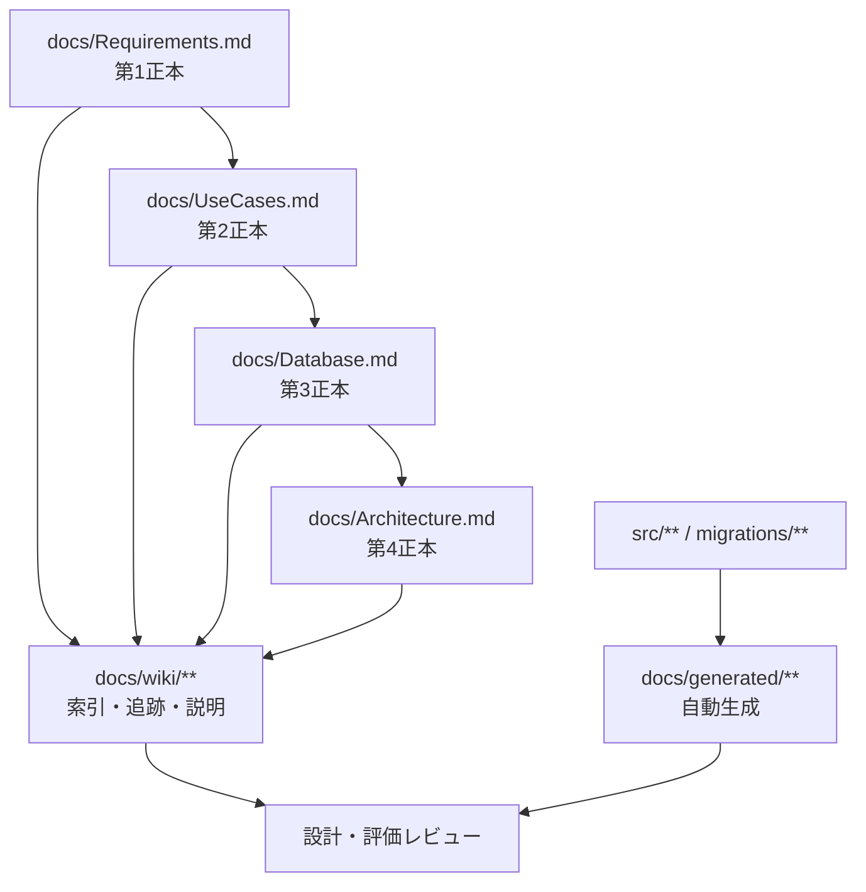
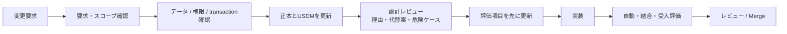

# 文書管理

## 目的

仕様の重複や古い設計の残存を防ぎ、変更時にどの文書と評価を更新するか判断できるようにします。

## 正本と派生文書

| 種別     | 役割                                       | 更新方法                                     |
| -------- | ------------------------------------------ | -------------------------------------------- |
| 正本     | 合意済みの要求・ユースケース・データ・構成 | 仕様変更と同じPRで人が更新                   |
| Wiki     | 読み順、追跡ID、設計詳細、評価計画         | 正本・実装・評価の変更と同じPRで更新         |
| ADR      | 重要な設計判断と代替案                     | 判断ごとに追記し、過去記録は原則上書きしない |
| 生成物   | ソースとmigrationの機械的な索引            | `npm run docs:generate` で更新。手編集しない |
| 評価記録 | 実施条件・期待結果・実測結果               | 対象版・環境・日時とともに記録               |

## 更新フロー

## 文書ID規則

- `BR-xxx`: Business / Stakeholder Requirement（要求）
- `SR-xxx`: System Requirement（要件）
- `SPEC-<領域>-xxx`: USDM仕様
- `SCR-xxx`: 画面
- `UC-xx`: ユースケース
- `UT-<領域>-xxx`: 単体評価
- `IT-<領域>-xxx`: 結合評価
- `ADR-xxxx`: 設計判断

IDは意味が変わる再利用をしません。廃止時は削除せず、状態を`Superseded`または`Deferred`として後継IDを示します。

## レビューの最低条件

- 正本との矛盾がない。
- 要求から評価まで追跡できる。
- 設計理由、トレードオフ、最低1つの代替案がある。
- RLS、外部入力、URL、秘密情報、エラー表示を確認している。
- 部分成功、二重送信、競合、越境アクセス、データ増大の破綻シナリオが記録されている。
