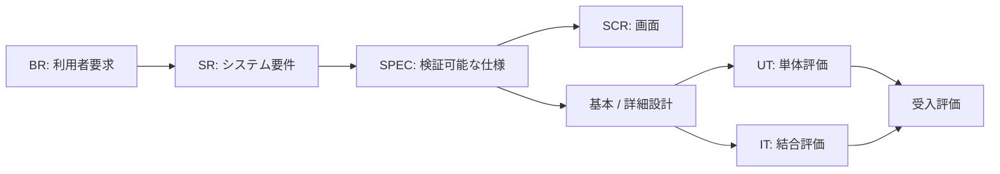

# トレーサビリティ

## 追跡方針

要求はUSDM仕様へ分解し、対応する設計境界と評価IDを結びます。詳細な期待値は各リンク先を正とします。

## 要求・設計・評価対応表

| 要求                      | 主なシステム要件 | USDM仕様                 | 主な設計境界                | 単体評価 | 結合・受入評価         |
| ------------------------- | ---------------- | ------------------------ | --------------------------- | -------- | ---------------------- |
| BR-001 現在の持ち物を把握 | SR-INV-001〜005  | SPEC-INV-*               | Item / Category、RLS        | UT-INV-* | IT-INV-001、UC-01      |
| BR-002 自分の基準で見直す | SR-REV-001〜004  | SPEC-REV-*               | `review_item` transaction   | UT-REV-* | IT-REV-001〜003、UC-02 |
| BR-003 理想との差を知る   | SR-IDL-001〜003  | SPEC-IDL-*               | Ideal集計 / Gap計算         | UT-IDL-* | IT-IDL-001、UC-03      |
| BR-004 固定費を把握       | SR-EXP-001〜003  | SPEC-EXP-*               | Expense正規化               | UT-EXP-* | IT-EXP-001、UC-04      |
| BR-005 全体を俯瞰         | SR-DSH-001〜002  | SPEC-DSH-*               | Dashboard並列集計           | UT-DSH-* | IT-DSH-001、UC-05      |
| BR-006 個人データを守る   | SR-AUTH-001〜004 | SPEC-AUTH-* / SPEC-SEC-* | Auth / RLS / ownership FK   | UT-SEC-* | IT-SEC-001〜004        |
| BR-007 安全に操作する     | SR-UX-001〜005   | SPEC-UX-*                | pending / error / app shell | UT-UX-*  | IT-UX-001、手動受入    |

## 変更漏れチェック

仕様IDを変更したPRでは、次を確認します。

1. [要求](../10-product/stakeholder-requirements.md)と[要件](../10-product/system-requirements.md)。
2. [USDM](../10-product/usdm.md)の理由・仕様・例外。
3. [表示画面](../20-ux/screen-catalog.md)と[画面遷移](../20-ux/screen-flow.md)。
4. [基本設計](../30-design/basic-design.md)、[詳細設計](../30-design/detailed-design.md)、[データ設計](../30-design/data-design.md)。
5. [単体評価](../40-quality/unit-evaluation.md)と[結合評価](../40-quality/integration-evaluation.md)。
6. 正本と生成ドキュメント。
