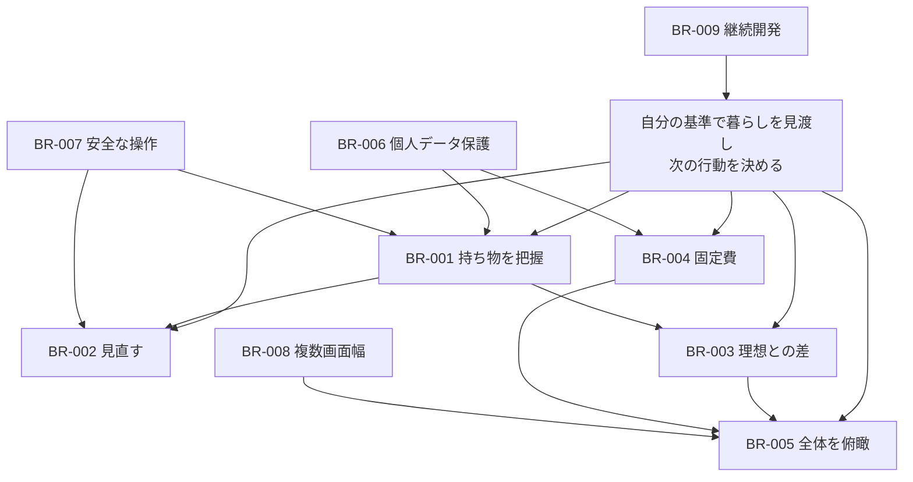

# 要求（Stakeholder Requirements）

## プロダクトの目的

Life Inventoryは、持ち物・理想の状態・固定費を可視化し、削減を強制せずに「次に何を見直すか」を利用者自身が決められる個人向けWebアプリです。

## ステークホルダー

| ステークホルダー | 関心事                                         | 成功の見え方                                   |
| ---------------- | ---------------------------------------------- | ---------------------------------------------- |
| 利用者           | 持ち物を無理なく記録し、自分の基準で判断したい | 現在・理想・差・支出を同じ場所で確認できる     |
| プロダクト所有者 | 判断を急かさない一貫した体験を提供したい       | 操作文言・状態・集計がプロダクト方針と一致する |
| 開発・運用者     | 安全に変更し、問題を再現・評価したい           | 正本、設計、テスト、運用手順が追跡できる       |
| データ管理者     | 個人データの越境参照と漏えいを防ぎたい         | 全公開テーブルのRLSと所有権制約が検証される    |

## 要求一覧

| ID     | 要求                                                               | 理由                                                 | 優先度 | 状態     |
| ------ | ------------------------------------------------------------------ | ---------------------------------------------------- | ------ | -------- |
| BR-001 | 利用者は現在の持ち物を短い入力で記録し、一覧・検索・分類できること | 記録コストが高いと棚卸しを継続できないため           | Must   | Accepted |
| BR-002 | 利用者は手放すことを強制されず、迷いを含めて持ち物を見直せること   | プロダクトの目的が削減ではなく判断支援だから         | Must   | Accepted |
| BR-003 | 利用者は現在と理想の数量差を把握できること                         | 次に増減すべき対象を感覚ではなく差で捉えるため       | Must   | Accepted |
| BR-004 | 利用者は毎月・毎年の固定費を把握できること                         | 所有物だけでなく継続的な支出も暮らしの構成要素だから | Must   | Accepted |
| BR-005 | 利用者は全体像から各作業へ移動できること                           | 個別記録だけでなく次の行動を選べる入口が必要だから   | Must   | Accepted |
| BR-006 | 利用者のデータは本人以外から参照・変更できないこと                 | 持ち物・支出はプライバシー性が高いため               | Must   | Accepted |
| BR-007 | 遅い通信や誤入力でも、保存状態を誤認せず再試行できること           | 二重登録・消失・保存済みの誤認を防ぐため             | Must   | Accepted |
| BR-008 | Desktopを中心に、Tablet / Mobileでも主要機能を利用できること       | 棚卸し場所や利用端末を限定しないため                 | Should | Accepted |
| BR-009 | 開発者は仕様・設計・評価・実装資料を辿れること                     | 継続開発時の判断根拠と変更影響を失わないため         | Should | Accepted |

## 要求関係

## 制約と対象外

- 認証はGoogle OAuthのみを利用者向けに提供します。
- 通常のItem操作はアーカイブであり、物理削除ではありません。
- MVPでは画像、URLからの商品取得、置換関係、90日自動Review、One In One Out、Resale、Ideal Budget、Mobile native appを対象外とします。
- 未マージ機能はAccepted要求へ含めません。採用時は正本・USDM・データ設計・評価を同じ変更で更新します。
