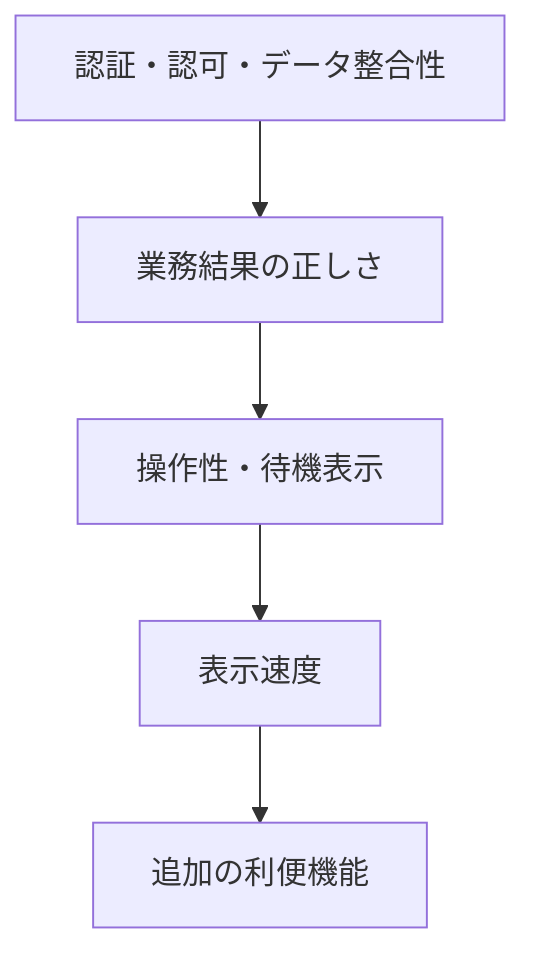

# 要件（System Requirements）

この文書は [Requirements](../../Requirements.md) の見出しへ追跡IDを付けた索引です。数値上限・対象外・優先関係を含む規範的な本文は正本を優先します。

## 機能要件

### Inventory

| ID         | 要件                                                                             | 対応要求       |
| ---------- | -------------------------------------------------------------------------------- | -------------- |
| SR-INV-001 | Active Itemを一覧表示し、名前・用途・メモ検索、Category / Status絞り込みを行える | BR-001         |
| SR-INV-002 | 名前、Category、数量を必須としてItemを追加・編集できる                           | BR-001         |
| SR-INV-003 | 任意の詳細情報と正規化された色 `#RRGGBB` を保存・表示できる                      | BR-001         |
| SR-INV-004 | ItemのStatusとReview Requestを個別に更新できる                                   | BR-002         |
| SR-INV-005 | Itemを物理削除せずArchiveし、通常集計から除外して履歴画面へ表示する              | BR-001、BR-002 |
| SR-CAT-001 | Category / Sub Categoryを追加・編集し、所有権の異なる組合せを拒否する            | BR-001、BR-006 |

### Review

| ID         | 要件                                                                    | 対応要求       |
| ---------- | ----------------------------------------------------------------------- | -------------- |
| SR-REV-001 | Activeかつ`status=MAYBE`または`review_requested=true`のItemを対象にする | BR-002         |
| SR-REV-002 | 対象を1件ずつ表示し、KEEP / MAYBE / RELEASEを判断できる                 | BR-002         |
| SR-REV-003 | Item更新とReview履歴追加を単一transactionで行う                         | BR-002、BR-007 |
| SR-REV-004 | 同一session・同一Itemの二重判断を冪等にし、完了件数を表示する           | BR-002、BR-007 |

### Ideal / Expense / Dashboard

| ID         | 要件                                                                | 対応要求 |
| ---------- | ------------------------------------------------------------------- | -------- |
| SR-IDL-001 | Ideal Itemの名前、Category、Target Quantityを登録・編集・削除できる | BR-003   |
| SR-IDL-002 | 同名・同CategoryのCurrent数量と比較してGapを計算する                | BR-003   |
| SR-IDL-003 | All / Reduce / Add / MatchedでGapを絞り込める                       | BR-003   |
| SR-EXP-001 | 固定費の名前、Category、金額、Billing Cycleを登録・編集・削除できる | BR-004   |
| SR-EXP-002 | MONTHLY / YEARLYを月額へ正規化し、月額合計と年額合計を表示する      | BR-004   |
| SR-EXP-003 | 年払いの場合のみ支払い月を任意入力できる                            | BR-004   |
| SR-DSH-001 | Current、Ideal、Gap、Review、Release、固定費の指標を集約表示する    | BR-005   |
| SR-DSH-002 | Category別数量を表示し、各機能へ遷移できる                          | BR-005   |

### Auth / Authorization

| ID          | 要件                                                                 | 対応要求       |
| ----------- | -------------------------------------------------------------------- | -------------- |
| SR-AUTH-001 | 利用者向け認証導線はSupabase AuthのGoogle OAuthに限定する            | BR-006         |
| SR-AUTH-002 | 未認証利用者をLoginへ誘導し、callback後は安全な同一origin pathへ戻す | BR-006、BR-007 |
| SR-AUTH-003 | 全domain tableに`user_id`を持たせ、RLSで本人行だけを許可する         | BR-006         |
| SR-AUTH-004 | Server Actionで再認証し、`user_id`を外部入力から受け取らない         | BR-006         |

## 非機能要件

| ID          | 要件                                                                | 評価観点                                  |
| ----------- | ------------------------------------------------------------------- | ----------------------------------------- |
| SR-UX-001   | Desktop優先、Tablet / Mobile対応。Mobileはbottom navigationを用いる | 代表画面幅、横スクロール、操作到達性      |
| SR-UX-002   | Keyboard、Focus、Contrast、aria-labelを保証する                     | Tab順、200% Zoom、支援技術向け名前        |
| SR-UX-003   | 更新中は競合操作を無効化し、処理内容を表示する                      | 二重送信、pending文言                     |
| SR-UX-004   | 失敗時は入力を保持し、対象フォーム内で再試行可能にする              | Offline、RLS拒否、検証エラー              |
| SR-UX-005   | 遷移中もApp Shellを維持し、押したナビと遷移先に待機状態を表示する   | 遅い遷移、戻る操作                        |
| SR-PERF-001 | Dashboard / Item Listは通常データ量で約1秒表示を目標とする          | データ件数・回線・端末条件を併記した測定  |
| SR-SEC-001  | 外部入力をサーバー側ZodとDB制約で検証する                           | 境界値、不正URL、所有権不一致             |
| SR-SEC-002  | 秘密情報をClient、ログ、fixture、生成文書へ出力しない               | bundle / Console / error responseレビュー |
| SR-MNT-001  | 仕様・設計・実装・評価の対応を文書IDで追跡できる                    | リンク検査とレビュー                      |

## 優先順位と競合

安全性と性能が競合する場合は、DB確定前に保存済みと見せる楽観更新を避け、正しい確定状態を優先します。
