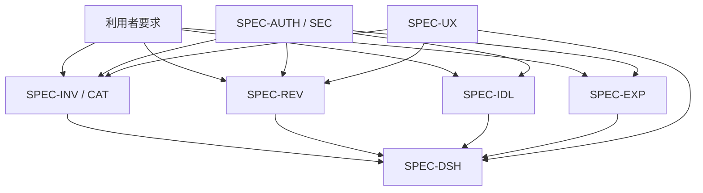

# USDM（Universal Specification Describing Manner）

USDMでは、利用者が望むことを「要求」、背景を「理由」、認識をそろえる情報を「説明」、検証可能な振る舞いを「仕様」に分けます。仕様IDは評価項目から参照します。

## BR-001 / BR-002 持ち物と見直し

### REQ-INV-01 持ち物を少ない負担で把握したい

**理由:** 棚卸し開始時の入力負担が高いと、利用者が記録を続けられないため。

**説明:** 最初は名前・カテゴリ・数量だけで登録でき、詳細は任意です。通常の削除は行わず、暮らしの記録としてアーカイブします。

| 仕様ID       | 仕様                                                                    | 例外・境界                                |
| ------------ | ----------------------------------------------------------------------- | ----------------------------------------- |
| SPEC-INV-001 | Active Itemの一覧に名前、Category、数量、Statusを表示する               | Archive済みは一覧と集計から除外           |
| SPEC-INV-002 | 名前1〜100文字、Category、数量1〜1,000,000を必須として追加・編集する    | サーバーとDBの両方で検証                  |
| SPEC-INV-003 | 名前・用途・メモの部分一致検索とCategory / Statusの組合せ絞り込みを行う | 不正queryは安全な既定値へ戻す             |
| SPEC-INV-004 | 任意URLはHTTP / HTTPSだけを受け付ける                                   | `javascript:` / `data:` / 不完全URLを拒否 |
| SPEC-INV-005 | 色は未設定または`#RRGGBB`へ正規化し、色チップと値を表示する             | 無効な既存値はCSSへ渡さない               |
| SPEC-INV-006 | Archive時に任意理由を保存し、Archive画面へ遷移する                      | Itemは物理削除しない                      |
| SPEC-CAT-001 | Category / Sub Categoryは利用者単位で名前重複を拒否する                 | Sub Categoryは同一Category内で一意        |
| SPEC-CAT-002 | Itemが参照するCategory / Sub Categoryの削除をDB制約で拒否する           | 現行UIは削除操作を提供しない              |

### REQ-REV-01 判断を急かされずに見直したい

**理由:** Life Inventoryは所有数の削減ではなく、利用者自身の判断基準を作るためのプロダクトだから。

**説明:** 明示的な見直し依頼と「迷っている」状態のどちらも見直し対象です。保留を選んだItemは、新しいsessionでは再び対象になります。

| 仕様ID       | 仕様                                                                      | 例外・境界                                   |
| ------------ | ------------------------------------------------------------------------- | -------------------------------------------- |
| SPEC-REV-001 | Activeかつ`MAYBE`またはReview Request ONのItemを1件ずつ表示する           | 同一sessionで判断済みのItemは除外            |
| SPEC-REV-002 | KEEP / MAYBE / RELEASEと任意メモを保存する                                | 判断値は列挙値以外を拒否                     |
| SPEC-REV-003 | Item状態更新、Review Request解除、履歴追加を単一DB functionで原子的に行う | 部分成功を許可しない                         |
| SPEC-REV-004 | 同一user / session / itemの再送は既存結果を返し、履歴を重複させない       | 新しいsessionでは再判断可能                  |
| SPEC-REV-005 | 対象がなくなったらsession内の判断件数を表示する                           | MAYBEを選んでも同じsessionで即時ループしない |

## BR-003 / BR-004 理想と固定費

### REQ-IDL-01 現在と理想の差を知りたい

**理由:** 増やす・減らす・維持する対象を、所有数だけでなく理想との差から判断するため。

**説明:** Ideal ItemはItemと直接結合せず、同じCategoryかつ正規化した同名Itemの数量合計と比較します。

| 仕様ID       | 仕様                                                            | 例外・境界                                  |
| ------------ | --------------------------------------------------------------- | ------------------------------------------- |
| SPEC-IDL-001 | 名前、Category、Target Quantityを必須としてIdeal ItemをCRUDする | Target Quantityは0〜1,000,000               |
| SPEC-IDL-002 | Gapを`target quantity - current quantity`で計算する             | Active ItemのみCurrentへ含める              |
| SPEC-IDL-003 | Gapが負=Reduce、正=Add、0=Matchedとして絞り込む                 | 同一user / Category / 正規化名のIdealは一意 |

### REQ-EXP-01 固定費を同じ周期で比較したい

**理由:** 月払いと年払いが混在すると総額を直感的に比較できないため。

**説明:** 保存値は入力された金額と周期を保持し、表示集計時に月額へ正規化します。

| 仕様ID       | 仕様                                                               | 例外・境界                         |
| ------------ | ------------------------------------------------------------------ | ---------------------------------- |
| SPEC-EXP-001 | 名前、Category、0以上の整数金額、Billing Cycleを必須としてCRUDする | 変動費は対象外                     |
| SPEC-EXP-002 | MONTHLYはamount、YEARLYはamount / 12を月額として集計する           | 表示時だけ丸め、内部計算精度を維持 |
| SPEC-EXP-003 | 年額を月額合計×12として表示する                                    | 支払い月はYEARLY時のみ任意         |

## BR-005 全体像

### REQ-DSH-01 次の行動を選べる全体像を見たい

**理由:** 個別画面へ入る前に、見直す対象や差の大きさを判断する入口が必要だから。

| 仕様ID       | 仕様                                                                     | 例外・境界                                |
| ------------ | ------------------------------------------------------------------------ | ----------------------------------------- |
| SPEC-DSH-001 | Current、Ideal、Gap、Review対象、Release数量、月額・年額固定費を表示する | Current / Releaseは行数でなくquantity合計 |
| SPEC-DSH-002 | Category別のActive Item数量を表示する                                    | データなしでも0と次の操作を表示           |
| SPEC-DSH-003 | 指標またはカードから対応機能へ移動できる                                 | 遷移中もApp Shellを維持                   |

## BR-006 / BR-007 認証・安全性

### REQ-AUTH-01 個人データを本人だけが扱えるようにしたい

**理由:** 持ち物と固定費は生活状況を推測できる高プライバシーデータだから。

| 仕様ID        | 仕様                                                               | 例外・境界                                       |
| ------------- | ------------------------------------------------------------------ | ------------------------------------------------ |
| SPEC-AUTH-001 | 未認証利用者をLoginへ誘導し、Google OAuthのみを表示する            | Gmail本文・連絡先の権限は要求しない              |
| SPEC-AUTH-002 | callbackの遷移先は同一originの相対pathだけを許可する               | `//`、backslash、外部originはDashboardへfallback |
| SPEC-SEC-001  | 全domain tableでRLSを有効にし、`auth.uid()=user_id`を強制する      | Client表示だけを認可にしない                     |
| SPEC-SEC-002  | Server Actionは認証を再確認し、外部入力から`user_id`を受け取らない | 所有者条件をmutation queryにも含める             |
| SPEC-SEC-003  | Category / Item等の複合FKで異なる所有者の参照を拒否する            | RLSとFKの両方で防御                              |

### REQ-UX-01 保存結果を誤認せず安全に操作したい

**理由:** 通信遅延・二重操作・検証エラーがデータ重複や入力消失につながるため。

| 仕様ID      | 仕様                                                                     | 例外・境界                    |
| ----------- | ------------------------------------------------------------------------ | ----------------------------- |
| SPEC-UX-001 | mutation中は対象操作を無効化し、処理内容を文言で表示する                 | 色だけで状態を表さない        |
| SPEC-UX-002 | 失敗時は成功表示へ切り替えず、入力を保持してフォーム内にエラーを表示する | 再試行可能にする              |
| SPEC-UX-003 | 遷移中はApp Shellを維持し、押したナビと本文に待機状態を表示する          | 戻る操作でも認証境界を維持    |
| SPEC-UX-004 | Keyboard、Focus、200% Zoom、Mobile navigationで主要操作へ到達できる      | Icon-only操作には名前を付ける |

## 仕様分解図

