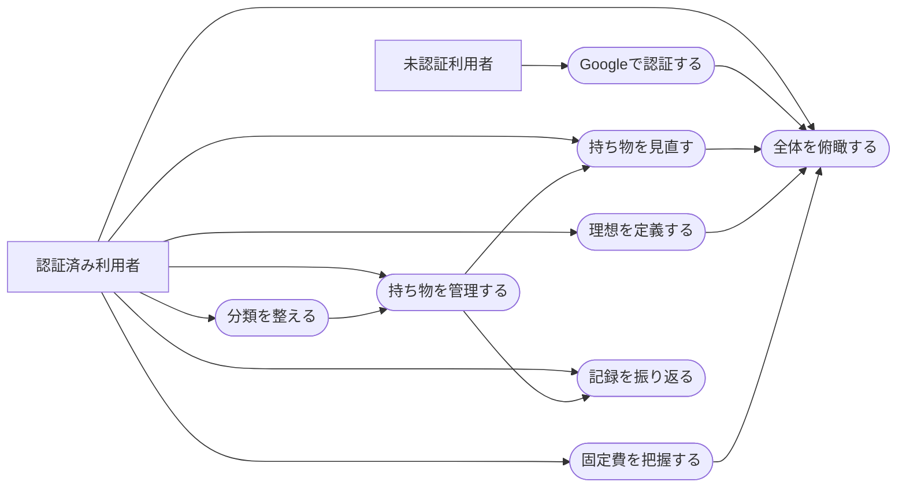

# ユースケース

正本は [UseCases](../../UseCases.md) です。この文書ではアクター・事前条件・基本フロー・代替フロー・事後条件を補足します。

## 全体図

## UC-01 Inventoryを管理する

- **アクター:** 認証済み利用者
- **事前条件:** 利用者が認証済みで、少なくとも1つのCategoryがある。
- **基本フロー:** 一覧を開く → 検索/絞り込み → Itemを追加または詳細表示 → 必要なら編集。
- **代替フロー:** 詳細でReview Requestを切替える。不要になったItemは理由を任意入力してArchiveする。
- **事後条件:** 保存が成功した場合だけ一覧・Dashboard・詳細の再検証後表示へ反映される。
- **失敗時:** 入力を保持し、フォーム内に安全なエラーを表示する。

## UC-02 Reviewする

- **アクター:** 認証済み利用者
- **事前条件:** `MAYBE`またはReview Request ONのActive Itemがある。
- **基本フロー:** session開始 → Itemを1件表示 → KEEP / MAYBE / RELEASEを選択 → 次のItemへ進む → 完了件数を確認。
- **代替フロー:** 対象がなければ空状態を表示する。MAYBEは新しいsessionで再び対象になる。
- **事後条件:** Item状態、Review Request、Review履歴が同時に確定する。
- **失敗時:** transaction全体を失敗させ、部分更新しない。

## UC-03 Idealを定義する

- **アクター:** 認証済み利用者
- **基本フロー:** Ideal Itemを登録 → Current / Ideal / Gapを確認 → Reduce / Add / Matchedで絞り込む。
- **代替フロー:** 既存Idealを編集・削除する。
- **事後条件:** DashboardのIdeal数量とGapが再計算される。

## UC-04 固定費を把握する

- **アクター:** 認証済み利用者
- **基本フロー:** 固定費を登録 → 月額・年額集計を確認 → 必要に応じて編集・削除。
- **代替フロー:** YEARLYでは支払い月を任意設定する。
- **事後条件:** Dashboardの固定費集計へ反映される。

## UC-05 状態を俯瞰する

- **アクター:** 認証済み利用者
- **基本フロー:** Dashboardを開く → 指標とCategory別数量を確認 → 見直したい機能へ移動。
- **代替フロー:** データがない場合は0と次の操作を示す。
- **事後条件:** なし（read-only）。

## UC-06 Googleで認証する

- **アクター:** 未認証利用者、Google、Supabase Auth
- **基本フロー:** Login → Google OAuth → Supabase callback → 安全なアプリ内pathへ遷移。
- **代替フロー:** 中断または失敗時はLoginへ戻り、再試行可能なエラーを表示。
- **セキュリティ条件:** 外部originへのredirectを許可せず、Gmail本文・連絡先権限を要求しない。
