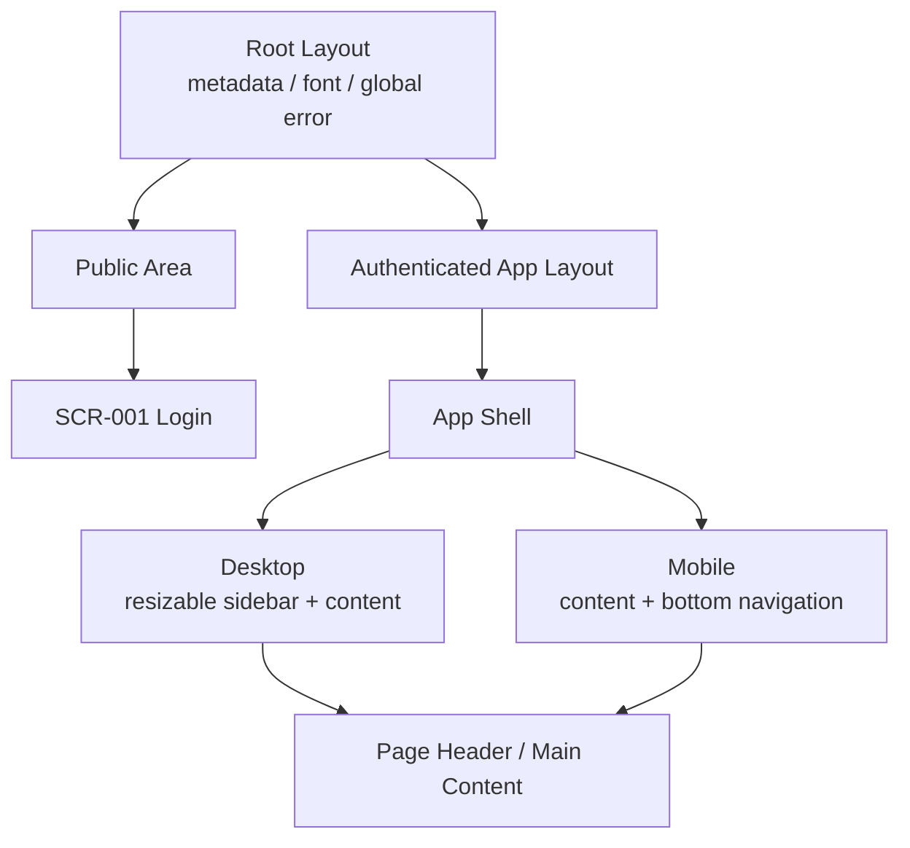

# 表示画面

## 画面一覧

| 画面ID  | パス                    | 画面名       | 主な表示                                                       | 主な操作                            | 認証       |
| ------- | ----------------------- | ------------ | -------------------------------------------------------------- | ----------------------------------- | ---------- |
| SCR-001 | `/login`                | ログイン     | プロダクト説明、Google認証、権限説明、OAuthエラー              | Googleで続ける                      | 不要       |
| SCR-010 | `/dashboard`            | インベントリ | Current / Ideal / Gap、見直し、Release、固定費、Category別数量 | 各機能へ移動                        | 必要       |
| SCR-020 | `/items`                | 持ち物一覧   | Active Item、数量合計、検索・Category・Status filter           | 絞り込み、追加、詳細へ移動          | 必要       |
| SCR-021 | `/items/new`            | 持ち物追加   | 必須3項目、任意詳細                                            | Itemを保存                          | 必要       |
| SCR-022 | `/items/:itemId`        | 持ち物詳細   | 基本・詳細情報、状態、Review Request                           | 編集、状態変更、見直し切替、Archive | 必要       |
| SCR-023 | `/items/:itemId/edit`   | 持ち物編集   | 保存済み値を設定したItem form                                  | 更新                                | 必要       |
| SCR-030 | `/review?session=:uuid` | 見直し       | 対象Item 1件、進行、直前判断、完了                             | KEEP / MAYBE / RELEASE              | 必要       |
| SCR-040 | `/ideal?filter=:value`  | 理想         | Current / Ideal / Gap、filter、Ideal form                      | 追加、編集、削除、絞り込み          | 必要       |
| SCR-050 | `/expenses`             | 固定費       | 月額・年額合計、Expense form / list                            | 追加、編集、削除                    | 必要       |
| SCR-060 | `/archive`              | アーカイブ   | Archive Item、日付、理由、価格                                 | 記録の参照                          | 必要       |
| SCR-070 | `/settings/categories`  | カテゴリ     | Category / Sub Category、おすすめ候補                          | 追加、編集                          | 必要       |
| SCR-900 | `*`                     | Not Found    | 対象がない説明                                                 | インベントリへ戻る                  | 状況による |
| SCR-901 | Error Boundary          | エラー       | 再試行可能な汎用エラー                                         | 再試行                              | 状況による |
| SCR-902 | route loading           | 読み込み     | App Shellを維持した待機表示                                    | 完了を待つ                          | 状況による |

`/auth/callback`と`/auth/confirm`は表示画面ではなく認証callback routeです。

## 画面レイアウト

## 主要画面の表示契約

### SCR-010 インベントリ

- ItemとIdealの値は行数ではなく数量合計を使います。
- Gapは`Ideal - Current`で、正数には`+`を付けます。
- Category別はActive Itemだけを集計します。
- 0件でもカード構造と次の移動先を維持します。

### SCR-020 持ち物一覧

- URL queryを一覧状態の入力とし、不正値は安全な既定値へ変換します。
- 絞り込み後の「個数」は表示中Itemのquantity合計です。
- Item全体を詳細へのリンクとして扱いつつ、Keyboard focusを視認可能にします。

### SCR-021 / 023 持ち物Form

- 最初に名前・Category・数量だけを見せます。
- 任意詳細は開閉でき、任意であることと最小限の入力ヒントを表示します。
- mutation中は保存操作を無効化し、成功前に保存済み表示へ切り替えません。

### SCR-030 見直し

- 1件ずつ判断し、同一sessionで同じItemを再表示しません。
- 対象なしとsession完了を区別し、完了時は判断件数を表示します。

### SCR-040 / 050 Ideal・固定費

- 追加欄の開閉ラベルは「追加」と「展開」を混同しない文言にします。
- 編集欄は数量・金額・周期の意味が分かる最小限のヒントを表示します。
- 削除は対象が明確で、保存中の競合操作を許可しません。

## 共通表示原則

- UIの基本言語は日本語です。保存列挙値や固有名は必要時だけ英語を使います。
- 数量、金額、件数、差は共通の数字用fontと桁表現を使います。
- Icon-only操作には`aria-label`または同等のアクセシブル名を付けます。
- 破壊的操作は色だけに依存せず、文言とアイコンでも区別します。
