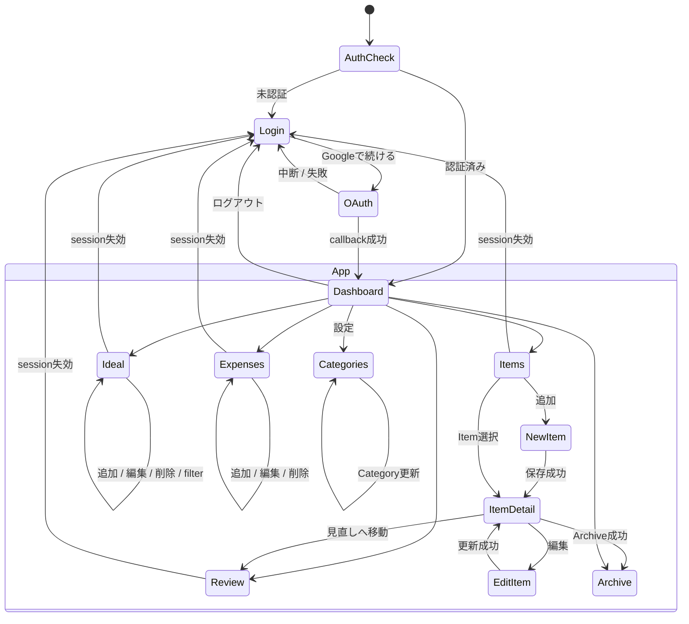
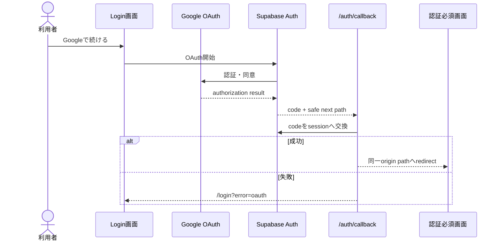
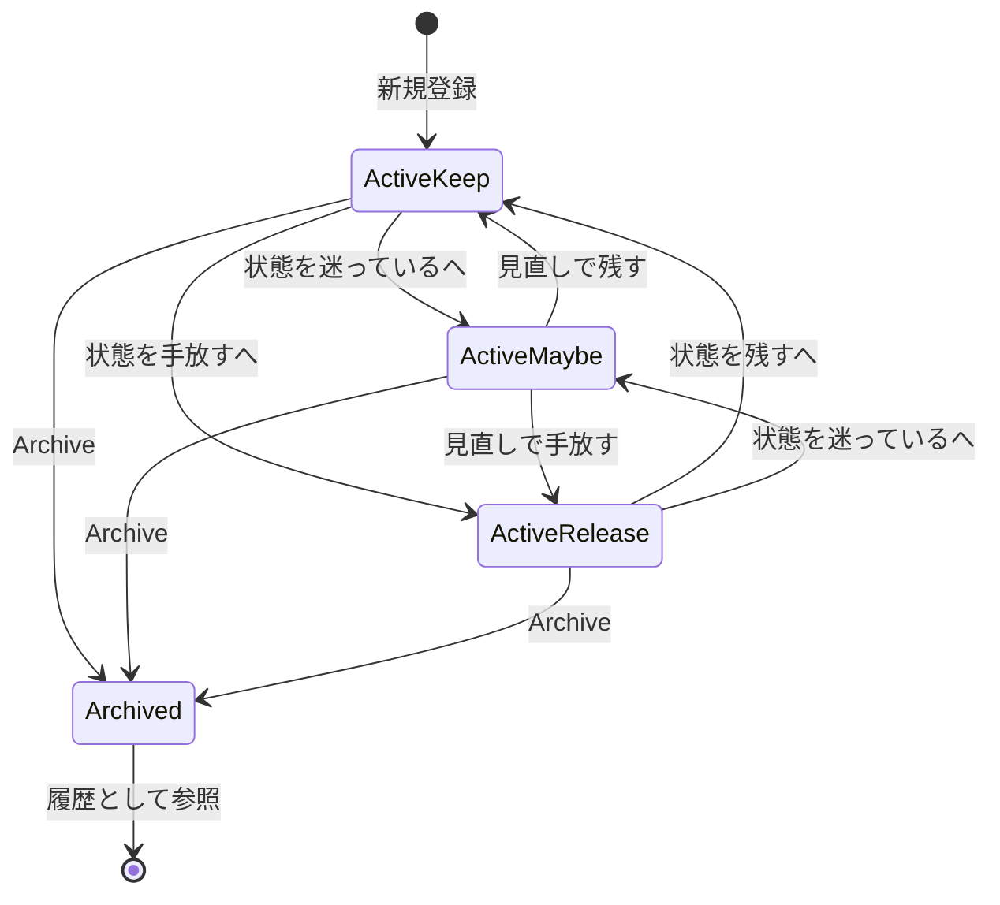

# 画面遷移

## 全体遷移

## 認証遷移

## Itemの状態と画面

Review RequestはStatusとは別のbooleanです。OFFでもStatusがMAYBEならReview対象のままです。

## 遷移ルール

- `/` は `/dashboard` へredirectし、認証境界で未認証なら `/login` へ進みます。
- Auth callbackの`next`は同一originの相対pathだけを許可します。
- mutation成功後は関連routeをrevalidateしてから遷移または再描画します。
- mutation失敗時は原則として同じ画面に留まり、入力とエラーを表示します。
- 存在しない、またはRLSで参照できないItem IDは他ユーザー情報を示さずNot Foundにします。
