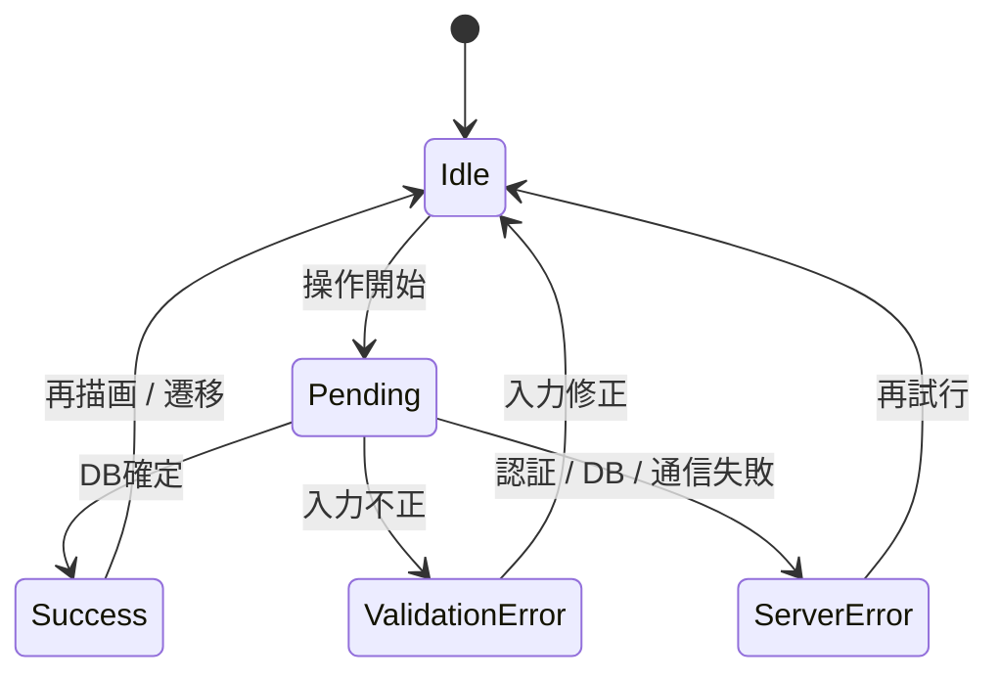
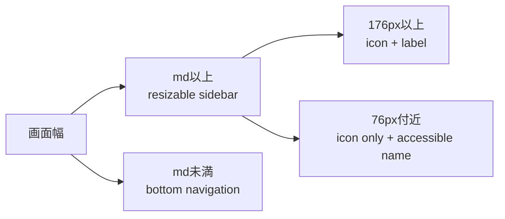

# UI状態設計

## 状態モデル

| 状態             | 表示                                 | 操作             | データ扱い                             |
| ---------------- | ------------------------------------ | ---------------- | -------------------------------------- |
| Idle             | 通常表示                             | 許可             | 最後に確定した値                       |
| Pending          | 「保存中…」等、遷移進捗              | 競合操作を無効化 | 入力は保持。未確定を保存済みに見せない |
| Validation Error | 対象field付近の説明                  | 修正・再送可     | 入力を保持                             |
| Server Error     | form内の安全な汎用文言、`role=alert` | 再送可           | 入力を保持                             |
| Success          | 再検証後の値                         | 通常へ戻す       | DB確定値だけを表示                     |

## Loading / Error / Empty

### Loading

- Root loadingと認証済みApp loadingを分けます。
- 認証済み画面遷移ではApp Shellを維持します。
- 押したnavigation linkにも固定幅のpending hintを表示し、レイアウトシフトを避けます。

### Error

- 利用者向けにはSQL、token、他ユーザーID、内部pathを表示しません。
- 再試行可能な障害は同じ文脈で再試行操作を提示します。
- Not Foundは「存在しない」と「権限がない」を区別して漏えいしません。

### Empty

| 画面      | Empty時に示す次の行動          |
| --------- | ------------------------------ |
| Dashboard | Item / Ideal / Expenseの開始先 |
| Items     | 持ち物を追加                   |
| Review    | 見直し対象の追加方法または完了 |
| Ideal     | 理想の持ち物を追加             |
| Expenses  | 固定費を追加                   |
| Archive   | Item詳細からArchiveできる説明  |

## Responsive

- Desktop sidebarは76〜360pxで変更でき、境界には`col-resize` cursorだけを表示します。
- Tablet / Mobileではform actionが縦書きにならず、画面外へ押し出されないよう折返しまたは段組みを切り替えます。
- 200% Zoomと文字サイズ拡大でも主要操作を失わないことを手動評価します。

## Accessibility

- Tab / Shift+Tabで主要ナビ、form、開閉、保存へ到達できます。
- Focusは常に視認でき、Icon-only操作にも意味の分かる名前があります。
- sidebar separatorはEnter / Spaceで開閉、左右矢印で変更、Homeで折りたためます。
- エラーとpendingは色だけで伝えません。
- motion低減設定では不要なanimationを抑えます。

## 採用理由・代替案

確定後更新を採用します。楽観更新は体感を短くできる一方、RLS拒否や通信断で「保存済み」に見える危険があるため、MVPの編集操作では採用しません。代替として、将来は取消可能で冪等な操作に限定して楽観更新を検討できます。
