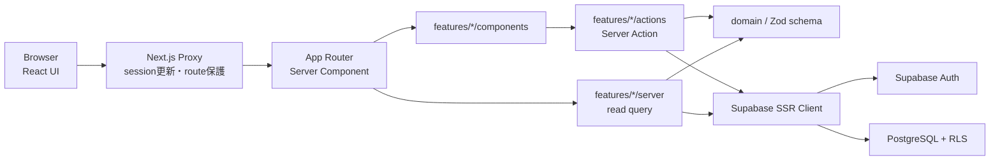
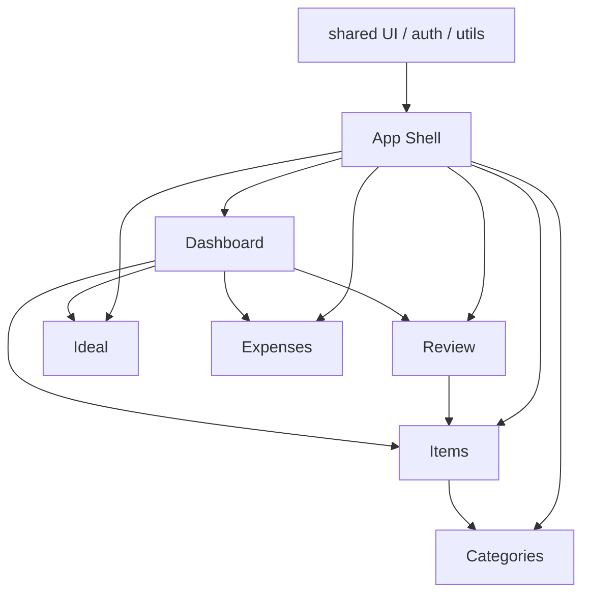

# 基本設計

## 1. 設計方針

Feature-based + lightweight Clean Architectureを採用します。routeはcomposition、業務計算はdomain、DBアクセスと認証はserver層へ分離します。

## 2. 論理コンポーネント

| コンポーネント          | 責務                                                        | 持たない責務             |
| ----------------------- | ----------------------------------------------------------- | ------------------------ |
| `src/app`               | routing、metadata、page composition、loading/error boundary | 業務計算、DB所有権ルール |
| `src/components`        | domain非依存のlayout、navigation、UI primitive              | Item / Review固有ルール  |
| `features/*/components` | feature UI、form state、pending / error表示                 | 認可の最終判断           |
| `features/*/schemas`    | 外部入力の型変換と検証                                      | DB transaction           |
| `features/*/domain`     | 純粋な計算・状態判定                                        | React、Supabase、network |
| `features/*/server`     | 認証済みread、View Model組立                                | Client表示状態           |
| `features/*/actions`    | mutation、再認証、再検証、revalidation                      | RLSの代替                |
| `src/lib/supabase`      | SSR client、cookie、proxy連携                               | feature固有query         |
| PostgreSQL              | 制約、所有権FK、RLS、原子的Review                           | UI文言                   |

## 3. Feature構成

## 4. データ・権限境界

- 全domain rowは`user_id`でAuth userに所有されます。
- 公開schemaのtableはRLSを有効にし、role grantとpolicyを別々に最小化します。
- Server Actionは`getClaims()`相当で利用者を再確認し、`user_id`をformから受け取りません。
- Review履歴は直接INSERTを許可せず、`review_item`だけをtransaction境界にします。
- Category / Sub Category / Itemは複合FKで所有権が一致する組合せだけを許可します。

## 5. 主要な設計判断

### Server Components + Server Actions

**理由:** App内のread / mutationへ不要なREST層を追加せず、認証済みサーバー処理へ集約できます。

**トレードオフ:** Mobile native client向けの公開API契約はありません。

**代替案:** `/api/v1`を設ける方式は複数clientには適しますが、MVPでは認証・validation・型の重複が増えるため不採用です。

### RLSを最終認可境界にする

**理由:** BrowserからData APIへ到達できる構成でも、DB row単位で越境を拒否できます。

**トレードオフ:** policyとgrantの組合せをmigrationと統合テストで維持する必要があります。

**代替案:** BackendだけにDB keyを置く方式はAPI境界を一元化できますが、現行Supabase構成の利点を失い、別backend運用が必要になるため不採用です。

### 確定後更新

**理由:** RLS拒否・通信断・DB constraint errorで保存されていない値を、保存済みとして見せないためです。

**トレードオフ:** mutation latencyをそのまま感じやすいため、pending表示とquery並列化が必要です。

**代替案:** 楽観更新は取消可能かつ冪等な操作へ将来限定導入できます。

## 6. 非機能設計

| 観点            | 方針                                                                                |
| --------------- | ----------------------------------------------------------------------------------- |
| Performance     | 認証後に独立したreadを`Promise.all`で並列化。Itemsは500件、Dashboardは各5,000件上限 |
| Availability    | read失敗はerror boundary、mutation失敗はform内再試行。DB確定前の成功表示なし        |
| Accessibility   | semantic HTML、視認可能Focus、keyboard、aria-label、motion低減                      |
| Responsive      | Desktop sidebar / Mobile bottom navigation。form actionの折返しを保証               |
| Maintainability | feature境界、純粋domain test、追跡ID、ADR、生成docs                                 |
| Security        | OAuth、safe redirect、server validation、ownership query、RLS、DB constraint        |

## 7. 規模拡大時の危険ケース

- `%term%`検索はItem増大時に遅くなるため、`pg_trgm`または検索列を検討します。
- Dashboardが5,000行をClient側相当のapp processで集計するため、上限超過時はDB aggregate / RPCへ移します。
- Items一覧は500件で打ち切るため、paginationなしでは「全件」と誤認する危険があります。上限接近前にpaginationと件数表示を設計します。
- Reviewの`SECURITY DEFINER`はRLSを迂回できるため、空の`search_path`、`auth.uid()`確認、最小EXECUTE grant、integration testを維持します。
