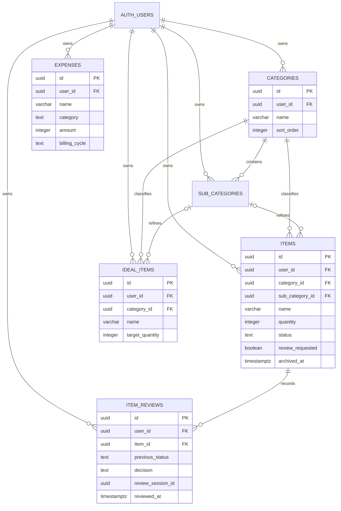
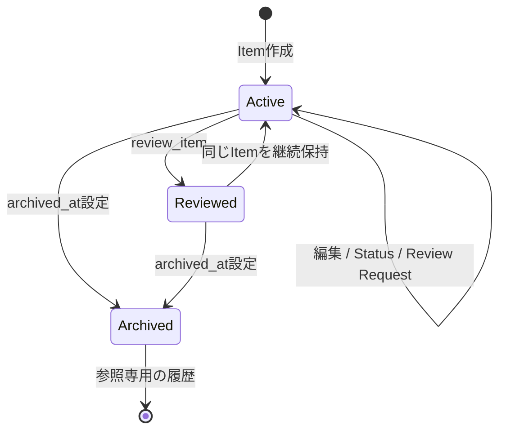

# データ設計

正本は [Database Design](../../Database.md)、実体は `supabase/migrations/*.sql` です。

## ER図

## Aggregateと更新境界

| Aggregate | Root          | 子・履歴         | 更新境界                                          |
| --------- | ------------- | ---------------- | ------------------------------------------------- |
| Category  | `categories`  | `sub_categories` | Category / Sub Category単位。参照中削除はrestrict |
| Item      | `items`       | `item_reviews`   | 通常編集はItem単体。Review判断はRPC transaction   |
| Ideal     | `ideal_items` | なし             | 1 row単位                                         |
| Expense   | `expenses`    | なし             | 1 row単位                                         |

## 主要制約

| 対象           | 制約                                               | 守る不変条件               |
| -------------- | -------------------------------------------------- | -------------------------- |
| 全domain table | UUID PK、`user_id -> auth.users on delete cascade` | owner不在データを残さない  |
| Category       | user + lower(name) unique                          | 同一userの重複名を防ぐ     |
| Sub Category   | user + category + lower(name) unique               | 同一Category内の重複を防ぐ |
| Item           | ownerを含むCategory / Sub Category複合FK           | 他userの分類を参照しない   |
| Item           | quantity 1〜1,000,000、status enum check           | 不正な状態をDBでも拒否     |
| Item Review    | user + session + item unique                       | 二重判断履歴を防ぐ         |
| Ideal          | user + category + trimmed lower(name) unique       | Gap比較の1対1基準を維持    |
| Expense        | amount 0〜1,000,000,000、cycle / category check    | 負額・未定義列挙値を拒否   |

## Lifecycle

Archiveは別tableへ移動せず、`archived_at`で状態を表します。通常一覧・Dashboard・Reviewは`archived_at is null`を必須条件にします。

## Index方針

- owner + sort / status / created / archived dateの主要queryに複合indexを置きます。
- Active / Archive / Review queueはpartial indexで対象rowを絞ります。
- FK列にはownerを含むindexを置きます。
- Itemの部分一致検索は現状indexが効きにくいため、規模拡大時は`pg_trgm`を候補にします。

## RLS / grant

- `public`の全6 domain tableでRLSを有効にします。
- `anon`へdomain table権限を付与しません。
- `authenticated`へUIが必要とする操作だけをgrantします。
- policyは`TO authenticated`に加え`(select auth.uid()) = user_id`を`USING` / `WITH CHECK`へ指定します。
- UPDATEにはSELECT policyが必要であることを前提に評価します。
- `item_reviews`のINSERT grant / policyはhardening migrationで撤回します。

## 設計上の注意

`review_item`はappend-only履歴へ書くために`SECURITY DEFINER`を使います。これはRLSを迂回できる高権限境界なので、空の`search_path`、`auth.uid()`検証、owner条件、対象性の再確認、最小grantを変更時に必ずレビューします。より安全な`SECURITY INVOKER`だけで実現する代替は、履歴INSERTをClient roleへ許可する必要が生じるため現行不変条件と両立しません。
