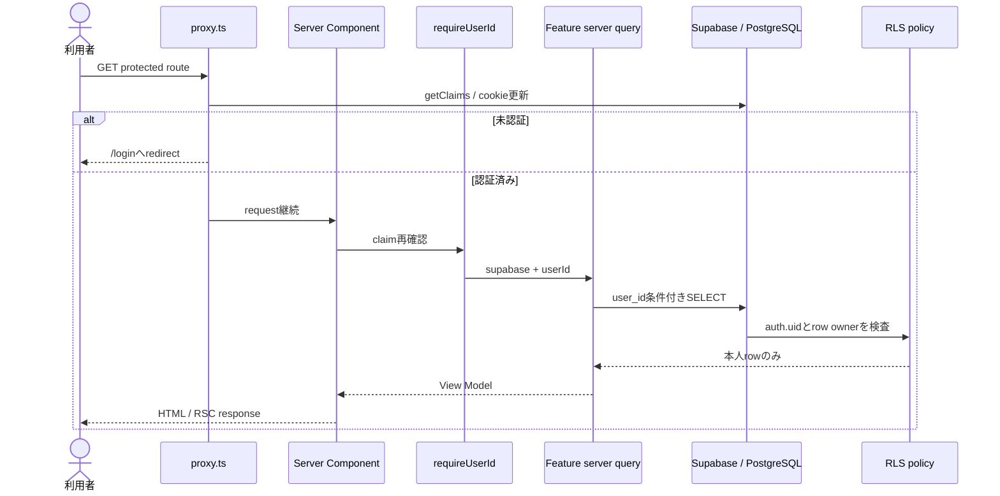
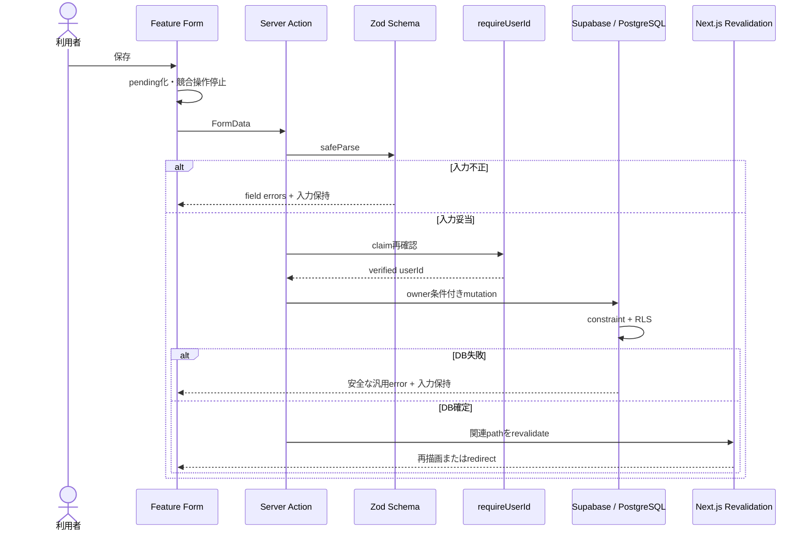
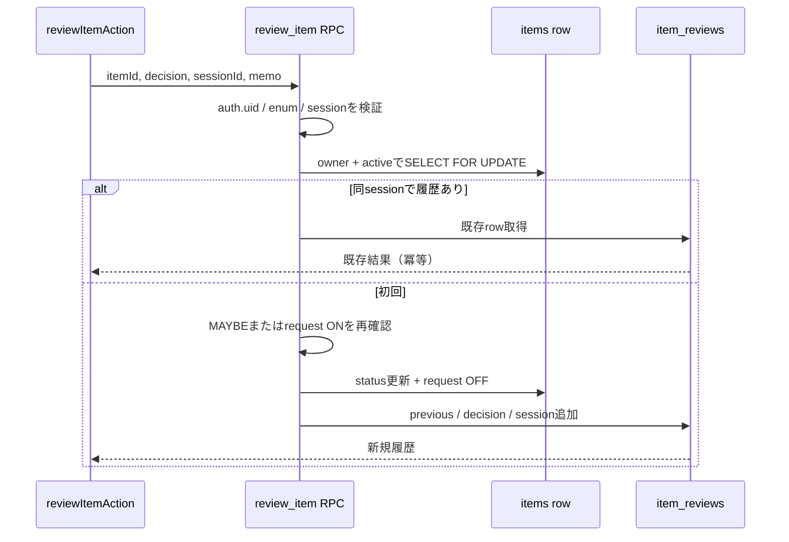

# 詳細設計

## 1. Read処理



### Query契約

- `getItems`: query stringをZodでparseし、危険なPostgREST filter文字を除去してActive Itemを最大500件取得します。
- `getItem`: ID・owner・Active条件で1件取得し、0件はNot Foundにします。
- `getIdealComparisons`: Category、Ideal、Active Itemを並列取得し、`categoryId + normalized name`で数量を集計します。
- `getDashboard`: Category、Item、Ideal、Expense、Review countを並列取得します。
- エラーは内部詳細を隠した日本語の汎用Errorへ変換します。

## 2. 一般mutation



### mutation後の再検証

| mutation                | revalidate先                                    | 成功後                      |
| ----------------------- | ----------------------------------------------- | --------------------------- |
| Item保存                | `/items`、`/dashboard`                          | Item詳細へredirect          |
| Item archive            | `/items`、`/archive`、`/dashboard`              | Archiveへredirect           |
| Review Request / Status | `/review`、Item詳細、`/items`または`/dashboard` | 同画面で確定値を表示        |
| Review判断              | `/review`、`/items`、`/dashboard`               | 同sessionの次Itemへredirect |
| Ideal保存 / 削除        | `/ideal`、`/dashboard`                          | Idealを再描画               |
| Expense保存 / 削除      | `/expenses`、`/dashboard`                       | Expenseを再描画             |
| Category保存            | `/settings/categories`、`/items`                | Categoryを再描画            |

## 3. Review transaction



### transaction不変条件

1. 未認証、他ユーザー、Archive済み、対象外Itemは判断できません。
2. Item更新と履歴INSERTは同じDB transactionで成功または失敗します。
3. `item_reviews`へauthenticated roleから直接INSERTできません。
4. `(user_id, review_session_id, item_id)`は一意です。
5. 同一sessionの再送は状態を再更新せず既存履歴を返します。

## 4. 集計アルゴリズム

### Gap

```text
key = category_id + ":" + trim(lower(name))
current_quantity = sum(active items.quantity by key)
gap = ideal.target_quantity - current_quantity
direction = gap < 0 ? REDUCE : gap > 0 ? ADD : MATCHED
```

### Expense

```text
monthly(expense) = MONTHLY ? amount : amount / 12
monthly_total = sum(monthly(expense))
yearly_total = monthly_total * 12
```

丸めは表示時に行い、集計途中の精度を維持します。

## 5. Validation境界

| 入力           | App境界                  | DB境界                           |
| -------------- | ------------------------ | -------------------------------- |
| UUID           | Zod UUID                 | UUID型、FK                       |
| 名前           | trim、長さ               | varchar / check、unique index    |
| 数量・金額     | coerce、integer、min/max | integer / check                  |
| Status / Cycle | Zod enum                 | check constraint                 |
| URL            | URL parse + HTTP/HTTPS   | 長さcheck。schemeの最終防御はApp |
| 所有者         | formから受け取らない     | RLS、複合FK                      |

## 6. Failure設計

| 破綻シナリオ                         | 防御                                     | 残る課題                                         |
| ------------------------------------ | ---------------------------------------- | ------------------------------------------------ |
| 二重submit                           | pending中disable、Review一意制約・冪等化 | 一般createはDB一意キーがないためUI制御依存が残る |
| Itemだけ更新され履歴なし             | DB function transaction                  | function変更時のintegration test必須             |
| 他user IDをURL指定                   | owner query + RLS + Not Found            | error文言で存在を漏らさない                      |
| CategoryとSub Categoryの所有者不一致 | 複合FK                                   | form候補もCategoryに従属させる                   |
| search filter注入                    | Zod +予約文字除去                        | 高度検索追加時は専用queryへ分離                  |
| 大量データ                           | query limit、index                       | pagination / DB aggregationが未実装              |
