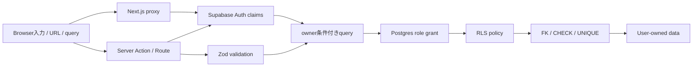
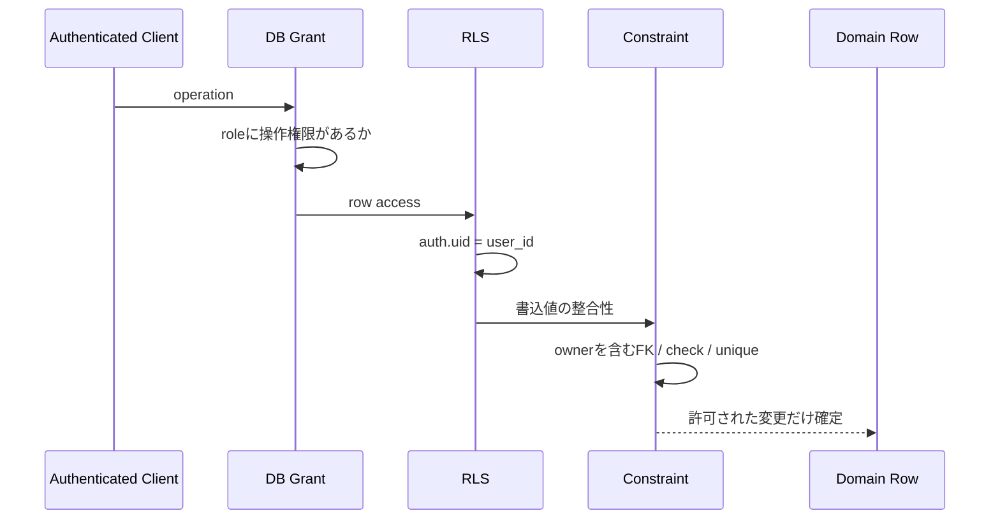

# セキュリティ設計

## Trust Boundary

Browser、FormData、URL parameter、query string、OAuth callback値、DB応答を信頼済み入力として扱いません。

## 認証

- 利用者向けはGoogle OAuthのみです。
- sessionは`@supabase/ssr`のcookie連携で更新します。
- proxyのroute保護に加え、server query / actionで`getClaims()`を使って再確認します。
- OAuth callbackのredirect先は同一originの相対pathだけを許可します。
- Clientへ公開するのはSupabase URLとpublishable keyだけです。service role / secret keyを置きません。

## 認可

`TO authenticated`だけでは認可にならないため、全policyに所有者条件を持たせます。UPDATEは既存rowの`USING`と更新後rowの`WITH CHECK`を両方使います。

## OWASP観点

| リスク                       | 対策                                                       | 評価                                   |
| ---------------------------- | ---------------------------------------------------------- | -------------------------------------- |
| Broken Access Control / IDOR | server owner条件、RLS、所有権FK、Not Found統一             | 2 userのread / update / insert越境test |
| Injection                    | Zod、列挙値、DB parameterization、検索予約文字の除去       | 不正query、HTML文字列、境界値          |
| Security Misconfiguration    | public table RLS、最小grant、function EXECUTE revoke/grant | migrationレビュー、DB integration      |
| Cryptographic Failures       | tokenを独自保存せずSupabase Auth/cookieへ委譲              | Client bundle / cookie属性確認         |
| Insecure Design              | Reviewを単一transaction、二重送信冪等化                    | 同時・再送・部分失敗test               |
| Vulnerable Components        | version固定、lockfile、CI                                  | dependency auditは別運用で記録         |
| Authentication Failures      | Google OAuth、claim再確認、安全なcallback                  | 未認証route、OAuth失敗、logout         |
| Data Integrity Failures      | CHECK / UNIQUE / FK、生成物を手編集しない                  | DB境界とdocs freshness                 |
| Logging Failures             | 利用者errorに内部情報を出さない                            | Console / responseの秘密情報確認       |
| SSRF                         | 現状server-side URL fetchなし。商品URLは保存・外部linkのみ | protocol validation、`rel=noreferrer`  |

## SECURITY DEFINERレビュー

`review_item`を変更する場合は以下を必須とします。

1. `search_path=''`を維持し、objectをschema修飾する。
2. `auth.uid()`がnullなら拒否する。
3. Itemを`id + user_id + active`でlockする。
4. Review対象性をlock後に再確認する。
5. `PUBLIC` / `anon`からEXECUTEをrevokeし、`authenticated`だけへgrantする。
6. user / session / item一意制約と冪等returnを維持する。
7. DB integration testで越境・直接履歴INSERT・再送を確認する。

## 秘密情報とプライバシー

- `.env.local`、OAuth client secret、access / refresh tokenをcommitしません。
- error、Console、fixture、スクリーンショット、生成docsに秘密情報や実ユーザーデータを含めません。
- Gmail本文・連絡先のscopeを要求しません。
- 個人データを新しい外部サービスへ送る機能は、送信前説明、明示操作、保存期間、削除、契約先を仕様化してから実装します。

## 残存リスク

- 一般create操作はReviewのようなidempotency keyを持たず、server到達後の再送重複をDBで完全には防ぎません。
- Item検索は文字列加工したPostgREST `or`を使うため、検索機能拡張時に専用RPCまたは安全な検索列を検討します。
- CSP、rate limit、監査log、session revoke運用は現行正本で明示されていません。本番公開前の運用設計で決定が必要です。

## 参照した公式情報

- [Supabase Row Level Security](https://supabase.com/docs/guides/database/postgres/row-level-security)
- [Supabase SSR Auth](https://supabase.com/docs/guides/auth/server-side)
- [Supabase Changelog](https://supabase.com/changelog)
