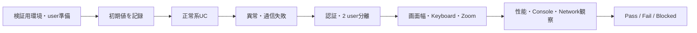

# 受入評価

詳細な手動項目は [Life Inventory MVP 手動受入チェックリスト](../../ManualAcceptanceChecklist.md) を正とします。この文書は要求単位の受入判断と記録方法を示します。

## 要求別の受入条件

| 要求   | 主要ユースケース | 合格条件                                                              |
| ------ | ---------------- | --------------------------------------------------------------------- |
| BR-001 | UC-01            | 最小3入力でItemを作成し、検索・絞り込み・編集・Archiveができる        |
| BR-002 | UC-02            | KEEP / MAYBE / RELEASEを1件ずつ判断し、同一sessionでloop / 重複しない |
| BR-003 | UC-03            | IdealとCurrentの差・方向が期待値と一致する                            |
| BR-004 | UC-04            | 月払い・年払いを混在させても月額・年額が一致する                      |
| BR-005 | UC-05            | Dashboard指標が各featureと一致し、次の画面へ移動できる                |
| BR-006 | UC-06 + 全UC     | 未認証を拒否し、2 userのデータが混ざらない                            |
| BR-007 | 全mutation       | pending、失敗、再試行、二重操作で保存状態を誤認しない                 |
| BR-008 | 全主要画面       | Desktop / Tablet / Mobile / 200% Zoomで操作が欠落しない               |
| BR-009 | 開発flow         | 要求→仕様→設計→評価→実装をWikiから追跡できる                          |

## 受入シーケンス



## 実施記録テンプレート

```markdown
# 受入結果: <version / commit>

- 実施日時:
- 実施者:
- 対象URL / environment:
- commit SHA:
- Browser / OS:
- 画面幅 / Zoom:
- Test user種別（実メールは記載しない）:

## 結果

| 要求ID | 結果                  | 証跡 | 不具合 / 備考 |
| ------ | --------------------- | ---- | ------------- |
| BR-001 | Pass / Fail / Blocked |      |               |

## 残存リスクと判断

- 残存リスク:
- 回避策:
- Release判断:
```

## 判断ルール

- 未実施と環境都合のBlockedをPassにしません。
- Must要求、認証・認可、Review transactionにFailがある場合はrelease不可です。
- UI差異は利用不能・誤保存・アクセシビリティ欠落につながる場合P1/P2として扱います。
- 既知差異は期限・owner・回避策を記録し、仕様へ暗黙に取り込みません。
