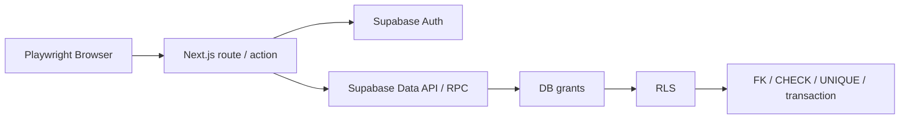
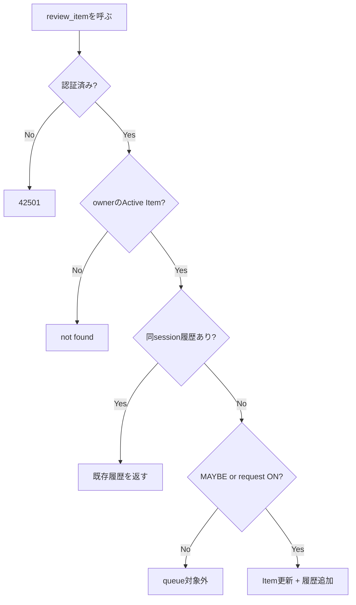

# 結合評価

## 対象境界



## DB結合評価

| 評価ID     | シナリオ                                     | 期待結果                                         | 現状                       |
| ---------- | -------------------------------------------- | ------------------------------------------------ | -------------------------- |
| IT-SEC-001 | ownerが自分のCategory / Itemを作成・参照     | 成功                                             | 自動testあり。今回未実行   |
| IT-SEC-002 | strangerがowner ItemをSELECT / UPDATE        | 0件、情報漏えいなし                              | 自動testあり。今回未実行   |
| IT-SEC-003 | strangerがownerの`user_id`でINSERT           | RLS拒否                                          | 自動testあり。今回未実行   |
| IT-SEC-004 | authenticatedがReview履歴へ直接INSERT        | grant / policyで拒否                             | 自動testあり。今回未実行   |
| IT-REV-001 | Review判断                                   | Item status更新、request OFF、履歴追加が同時成功 | 自動testあり。今回未実行   |
| IT-REV-002 | 同一session / Itemの再送                     | 同じ履歴を返し、履歴件数は増えない               | 自動testあり。今回未実行   |
| IT-REV-003 | MAYBE判断後に新しいsession開始               | 新sessionでは対象、旧sessionでは対象外           | 自動testあり。今回未実行   |
| IT-IDL-001 | 同一user / Category / trim+case同名Ideal追加 | 2件目をunique constraintで拒否                   | 自動testあり。今回未実行   |
| IT-CAT-001 | 他user CategoryをItemへ指定                  | RLSまたは所有権FKで拒否                          | 追加推奨                   |
| IT-INV-001 | Archive後の各集計・Review queue              | Itemを全Active集計から除外                       | E2E / 手動中心。DB追加推奨 |
| IT-EXP-001 | Expense mutation後のDashboard                | 月額・年額が一致                                 | E2E / 手動中心             |

## Browser E2E

| 評価ID      | シナリオ                                       | 期待結果                                                         | 現状                                 |
| ----------- | ---------------------------------------------- | ---------------------------------------------------------------- | ------------------------------------ |
| IT-AUTH-001 | Login表示                                      | Google導線だけ、Gmail本文へアクセスしない説明、Console errorなし | 自動testあり。今回未実行             |
| IT-AUTH-002 | 未認証で`/dashboard`                           | `/login`へredirect                                               | 自動testあり。今回未実行             |
| IT-FLOW-001 | Item追加→Review→Category→Ideal→Expense→Archive | 主要MVP flowが完走し、Console errorなし                          | testはあるが現行UIとselector差異あり |
| IT-UX-001   | Desktop / Mobile navigation                    | 主要画面へ到達し横overflowなし                                   | 手動評価中心                         |
| IT-SEC-005  | 2 userでItem URL越境                           | 内容参照・更新不可                                               | 手動受入。E2E追加推奨                |

## Review transaction詳細ケース



## 前提・実行

```bash
npm run supabase:start
npm run supabase:reset
npm run test:db
npm run test:e2e
npm run supabase:stop
```

- Dockerとlocal Supabaseが必要です。
- E2Eはlocal AuthのEmail / Passwordをfixture作成に使いますが、製品UIの認証方式はGoogle OAuthのみです。
- OAuth本番連携はClient ID / Secretを使うため、秘密情報を保存しない手動評価として分離します。
- `tests/e2e/authenticated-flow.spec.ts`には旧英語UIのselectorが残っています。現行日本語UIへ同期し、local Supabase上で成功するまではIT-FLOW-001をPass扱いにしません。

## 記録フォーマット

| 項目                         | 記録内容                              |
| ---------------------------- | ------------------------------------- |
| 対象commit                   | SHA                                   |
| 実施日時                     | ISO 8601 + timezone                   |
| Supabase CLI / Docker / Node | version                               |
| migration                    | 適用version一覧                       |
| 実行command                  | 実際のcommand                         |
| 結果                         | Pass / Fail / Blocked                 |
| 証跡                         | 秘密情報を含まないlog / traceへのpath |
| 不具合                       | Issue / 再現手順                      |
