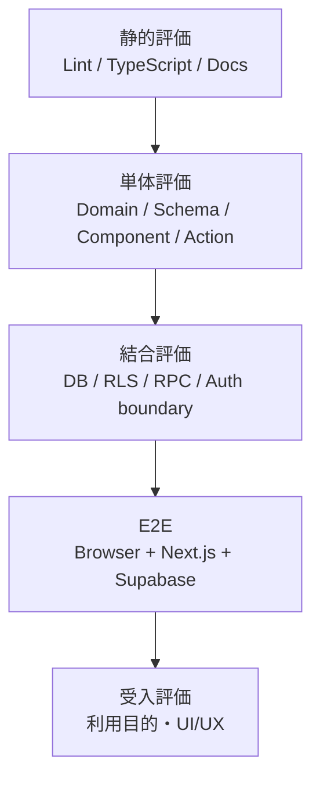
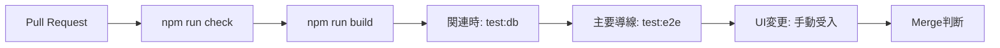

# 評価戦略

## 目的

評価は、要求を満たすこと、データ不変条件を壊さないこと、本人以外のデータへ到達できないことを、最も低い実行コストの層から確認します。

## 評価レベル

| レベル   | 主対象                                        | 実行                                                      | 合格条件                           |
| -------- | --------------------------------------------- | --------------------------------------------------------- | ---------------------------------- |
| 静的     | TypeScript、ESLint、docs freshness            | `npm run lint`、`npm run typecheck`、`npm run docs:check` | warning / errorなし                |
| 単体     | pure domain、Zod、React component、Action分岐 | `npm run test`                                            | 全test成功                         |
| DB結合   | migration、RLS、FK、RPC transaction           | local Supabase + `npm run test:db`                        | owner / stranger / retryが期待通り |
| E2E      | Browserから主要導線                           | local Supabase + `npm run test:e2e`                       | Console errorなし、主要flow完走    |
| Build    | production bundle                             | `npm run build`                                           | build成功、秘密情報混入なし        |
| 手動受入 | responsive、accessibility、OAuth、UX          | checklist                                                 | 対象項目に結果と環境を記録         |

## 品質ゲート

- DB / migration / RLS / RPC変更ではDB結合評価を省略しません。
- 認証・route・主要導線変更ではE2Eを実行します。
- layout / navigation / form変更ではKeyboard、Focus、代表画面幅、200% Zoomを手動確認します。
- 文書だけの変更でもリンク、Mermaid、正本との整合性、`npm run docs:check`を確認します。

## Test Data

- 本番データを使いません。
- E2E / DB評価は一意なテストユーザーと値を生成します。
- screenshot、trace、Console、CI artifactにtoken・cookie・実メール・個人データを残しません。
- local Supabaseはmigrationからresetできる状態を前提にします。

## Exit Criteria

1. Must要求の対応評価が成功している。
2. P1 / P2の既知不具合がない、または受入判断者が残存リスクを明示承認している。
3. RLS越境、Review部分成功、二重履歴、Open Redirectが再現しない。
4. Loading / Error / Empty、Keyboard、Focus、Responsiveを確認している。
5. 未実施項目は「成功」扱いにせず、理由・期限・ownerを記録している。
