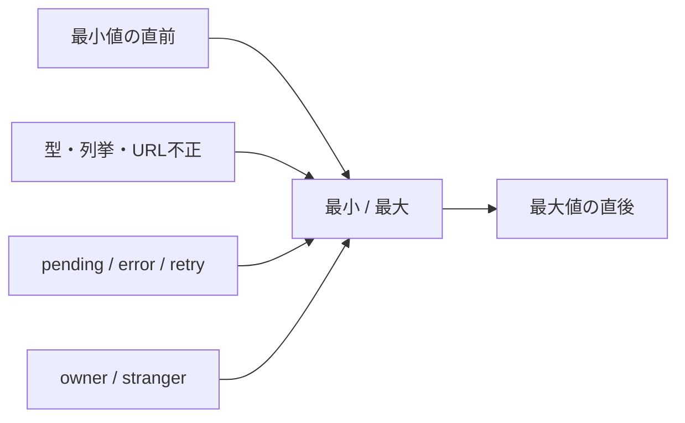

# 単体評価

## 評価方針

外部I/Oなしで検証できる業務計算・input schemaを最優先にします。Componentは利用者に見える状態とアクセシブルな操作を確認し、Server Actionは認証済みquery・error・revalidation分岐をmockして確認します。

## Domain / Schema

| 評価ID     | 対象            | 条件                                     | 期待結果                  | 現状                     |
| ---------- | --------------- | ---------------------------------------- | ------------------------- | ------------------------ |
| UT-INV-001 | Item数量集計    | quantity 2, 3, 0件                       | 5、0                      | 自動test成功             |
| UT-INV-002 | Item色正規化    | preset、`#dc2626`、不正値、空            | `#DC2626`、拒否、未設定   | 自動test成功             |
| UT-INV-003 | Item schema     | 名前空、quantity 0 / 小数 / 上限超       | field error               | 色以外の境界test追加推奨 |
| UT-INV-004 | Item URL        | HTTP / HTTPS、javascript / data / 不完全 | 前者だけ許可              | 追加推奨                 |
| UT-IDL-001 | Gap             | current 3 / target 1, 3, 5               | -2 / 0 / +2と方向         | 自動test成功             |
| UT-EXP-001 | Expense正規化   | 月額1,200、年額12,000                    | 月額合計2,200、年額26,400 | 自動test成功             |
| UT-CAT-001 | Category schema | 空、50文字、51文字、負sort               | 境界だけ許可              | 追加推奨                 |
| UT-REV-001 | Review schema   | decision列挙外、session不正、memo超過    | validation error          | 追加推奨                 |
| UT-SEC-001 | Safe redirect   | `/items`、`//evil`、backslash、外部URL   | app pathまたはDashboard   | 自動test成功             |

## Component / Interaction

| 評価ID    | 対象                  | 評価内容                                         | 現状                                        |
| --------- | --------------------- | ------------------------------------------------ | ------------------------------------------- |
| UT-UI-001 | SubmitButton          | pending中disabled、pending label、重複操作防止   | 自動test成功                                |
| UT-UI-002 | GoogleAuthButton      | callback指定、provider errorの秘匿               | 自動test成功。pending test追加推奨          |
| UT-UI-003 | ItemForm              | 任意詳細の目的と入力hint                         | 自動test成功。最小入力・error保持は追加推奨 |
| UT-UI-004 | ItemColorField        | preset / palette / hex同期、色chip               | 自動test成功                                |
| UT-UI-005 | ItemStateControls     | 競合操作の無効化、失敗表示                       | 自動test成功。ON/OFF結果はActionで補完      |
| UT-UI-006 | ItemList              | 狭い本文幅でfilterを縦配置                       | 自動test成功。empty・数量・linkは追加推奨   |
| UT-UI-007 | IdealForm             | 数量・価格の入力hint                             | 自動test成功。CRUD interactionは追加推奨    |
| UT-UI-008 | ExpenseForm           | 金額・周期の入力hint                             | 自動test成功。周期切替・pendingは追加推奨   |
| UT-UI-009 | CategoryManager       | 編集影響とSub Category用途のhint                 | 自動test成功。保存interactionは追加推奨     |
| UT-UI-010 | AppShell              | active navigation、keyboard collapse、logout配置 | 自動test成功。pointer resizeは追加推奨      |
| UT-UI-011 | NavigationPendingHint | link pending時のannounceとlayout維持             | 自動test成功                                |

## Server Action

| 評価ID     | 対象                          | 条件                                    | 期待結果                            | 現状         |
| ---------- | ----------------------------- | --------------------------------------- | ----------------------------------- | ------------ |
| UT-ACT-001 | Review Request切替            | owner Item、ON/OFF                      | owner条件付きupdate、関連path再検証 | 自動test成功 |
| UT-ACT-002 | 状態更新失敗 / Review入力不正 | DB error / 未定義flag                   | 安全なerror、revalidateなし         | 自動test成功 |
| UT-ACT-003 | Item保存                      | validation / insert / update / DB error | redirectまたは入力保持error         | 追加推奨     |
| UT-ACT-004 | Ideal / Expense保存           | create / update / invalid / DB error    | 適切な再検証とerror                 | 追加推奨     |
| UT-ACT-005 | Category保存                  | duplicate / ownership mismatch          | form内error、他user更新なし         | 追加推奨     |

## カバレッジより重視する境界



行カバレッジ率だけを完了条件にしません。数量、金額、URL、所有権、二重操作、状態遷移の危険境界が具体的な期待結果で評価されていることを優先します。

## 実行

```bash
npm run test
```

失敗時は、test名、対象仕様ID、入力、期待値、実際値を記録します。snapshotの大量更新で差異を隠しません。
