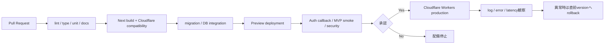
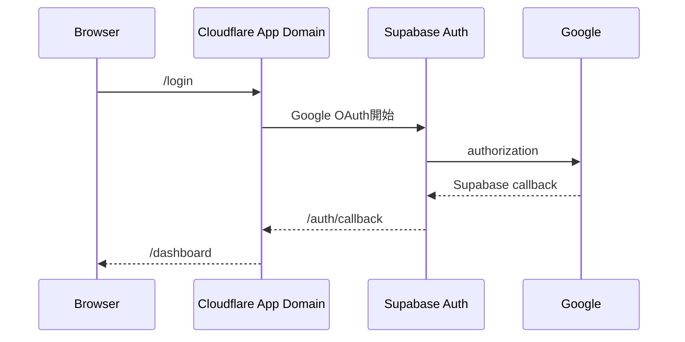
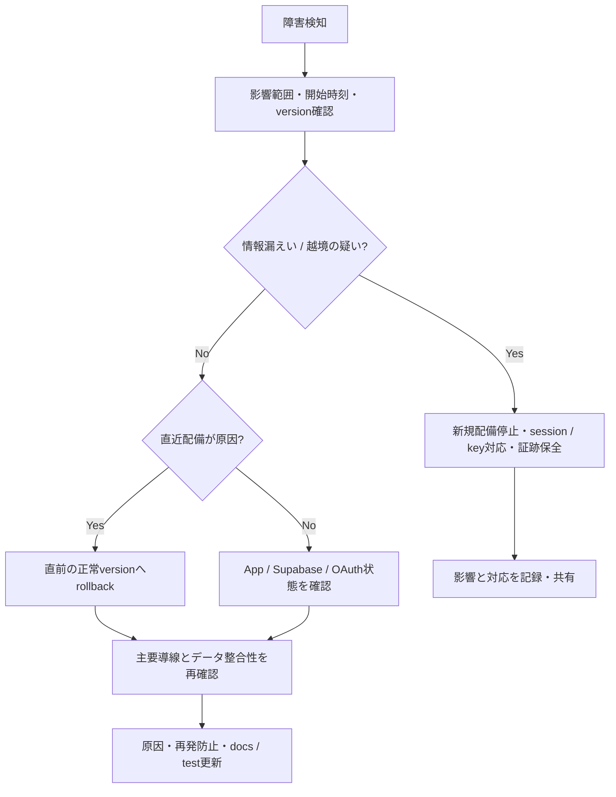

# デプロイ・運用

## 現在の状態

このリポジトリの現行`main`には、特定hosting provider向けの本番設定とCI/CDがまだありません。Cloudflare Workersを第一候補としますが、設定済み・配備済みとは扱いません。

## 配備候補の判断

2026-08-30時点のCloudflare公式ガイドは、既存Next.js 16をWorkersで動かす既定経路としてvinextを案内しています。一方でvinextはbetaであり、導入前にcompatibility checkが必要です。

| 案                          | 利点                                                                  | リスク / コスト                                          | 判断                |
| --------------------------- | --------------------------------------------------------------------- | -------------------------------------------------------- | ------------------- |
| Cloudflare Workers + vinext | Cloudflare上でNext.js App Router / Server Actions / proxyを扱える候補 | beta、Next.js API互換性、画像最適化、build差の検証が必要 | Proposed / 第一候補 |
| Vercel                      | Next.jsとの統合が直接的                                               | provider変更、費用・運用方針の再評価が必要               | 代替案              |
| Static export               | 配備が単純                                                            | Server Actions / SSR / Auth構成と両立しない              | 不採用              |

Cloudflare採用時は、compatibility結果、local / preview / productionの差、rollback、Supabase接続をADRとしてAcceptedにしてから設定をmergeします。

## 想定配備フロー（未実装）

## Environment

| 環境       | 用途               | データ                               |
| ---------- | ------------------ | ------------------------------------ |
| Local      | 開発・自動評価     | local Supabaseの合成データ           |
| Preview    | PRごとの結合・受入 | 本番と分離したSupabase project推奨   |
| Production | 利用者向け         | 本番Supabase。最小権限、backup、監視 |

必要な公開設定:

- `NEXT_PUBLIC_SUPABASE_URL`
- `NEXT_PUBLIC_SUPABASE_PUBLISHABLE_KEY`

秘密設定:

- Google OAuth Client SecretはSupabase Dashboard側へ設定し、app bundleへ含めません。
- 将来server secretが必要になった場合もCloudflare secretとして管理し、GitやPreview logへ出しません。

## OAuth設定

- Supabase Site URLをproduction domainへ設定します。
- Additional Redirect URLsへPreviewを無制限wildcardで許可せず、必要範囲だけ登録します。
- Google Cloud Authorized redirect URIはSupabase Auth callback URLです。
- App側callbackは`https://<app-domain>/auth/callback`です。

## Release前チェック

- `npm run check`、`npm run build`、`npm run test:db`、主要E2Eが成功。
- 全migration versionがrepoと対象Supabaseで一致。
- Google OAuthのproduction / preview redirectが意図したdomainだけ。
- 2 userのRLS分離、Open Redirect拒否、Logout後の再アクセス拒否を確認。
- Browser Console / Network / build outputにsecret・token・個人情報がない。
- Error / Loading / Empty、Mobile、Keyboard、200% Zoomを確認。
- rollback対象versionと実施者を記録。

## Incident Runbook

削除・migration rollbackなどデータを失う操作は、対象と復旧手段を確認してから別承認で行います。

## 参照

- [Cloudflare Next.js guide](https://developers.cloudflare.com/workers/framework-guides/web-apps/nextjs/)
- [Supabase production checklist](https://supabase.com/docs/guides/deployment/going-into-prod)
