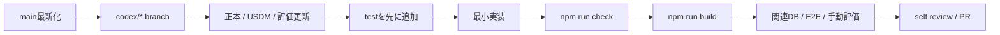

# 開発ガイド

## 前提

- Node.js 22以上
- npm
- Docker（local Supabase / DB integration / authenticated E2E時）
- Supabase CLIはdevDependencyの固定versionを利用

## Local Setup

```bash
npm install
cp .env.example .env.local
npm run dev
```

`.env.local`には公開可能なSupabase URLとpublishable keyだけを設定します。service role key、OAuth client secret、access tokenをClient向け変数やGitへ入れません。

## 開発フロー



## Command一覧

| 目的                      | Command                                            |
| ------------------------- | -------------------------------------------------- |
| 開発server                | `npm run dev`                                      |
| lint                      | `npm run lint`                                     |
| 型検査                    | `npm run typecheck`                                |
| unit test                 | `npm run test`                                     |
| 品質check                 | `npm run check`                                    |
| production build          | `npm run build`                                    |
| local Supabase開始 / 停止 | `npm run supabase:start` / `npm run supabase:stop` |
| migration再適用           | `npm run supabase:reset`                           |
| DB integration            | `npm run test:db`                                  |
| E2E                       | `npm run test:e2e`                                 |
| 開発者docs生成            | `npm run docs:generate`                            |
| 生成docs鮮度              | `npm run docs:check`                               |

## 変更別チェック

| 変更                  | 必須確認                                                             |
| --------------------- | -------------------------------------------------------------------- |
| Domain / Schema       | unit、境界値、typecheck                                              |
| React UI              | component test、Keyboard、Focus、Loading / Error / Empty、代表画面幅 |
| Server Action         | Zod、再認証、owner条件、pending、revalidation、error保持             |
| Query                 | RLS、owner条件、limit、index、N+1 / waterfall                        |
| Migration / RLS / RPC | local reset、DB integration、grant、advisors、生成型                 |
| Auth / callback       | safe redirect、未認証境界、OAuth手動確認                             |
| Docs                  | 正本優先、リンク、Mermaid、追跡表、`docs:check`                      |

## 文書更新

- 正本の仕様変更は `Requirements.md` → `UseCases.md` → `Database.md` → `Architecture.md` の影響を確認します。
- Wikiは要求ID・仕様ID・評価IDを同じPRで更新します。
- `docs/generated`は直接編集せず、source / migration / JSDocを直して`npm run docs:generate`します。
- ADRは重要な選択、理由、代替案、トレードオフを残します。

## Review Checklist

1. 仕様を暗黙に変更していない。
2. データモデル、所有権、transaction境界が先に確認されている。
3. 入力をClientだけで検証していない。
4. `any`やTypeScript error無効化で回避していない。
5. Loading / Error / Empty / pending / retryがある。
6. 越境アクセス、二重送信、部分成功、上限超過を検討した。
7. 秘密情報・個人情報がdiff / log / fixture / docsにない。
