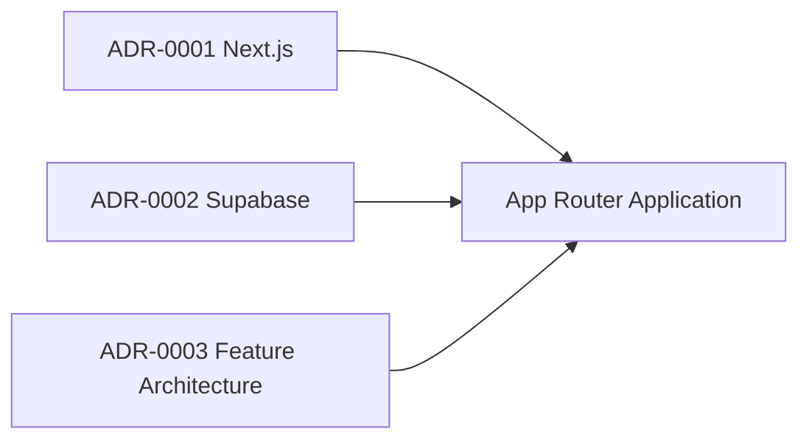

# ADR一覧

## 採用済み

| ADR                                                | 状態     | 判断                       | 主な理由                                                          |
| -------------------------------------------------- | -------- | -------------------------- | ----------------------------------------------------------------- |
| [ADR-0001](../../ADR/0001-use-nextjs.md)           | Accepted | Next.js App Router         | Server Components read、Server Actions mutation、薄いrouting      |
| [ADR-0002](../../ADR/0002-use-supabase.md)         | Accepted | Supabase                   | Auth、PostgreSQL、RLSを統合し、verified session + RLSを境界にする |
| [ADR-0003](../../ADR/0003-feature-architecture.md) | Accepted | Feature-based architecture | 業務領域とコード所有範囲を一致させる                              |



## ADR追加が必要な判断

- 本番hosting providerとCloudflare Workers / vinextの採否。
- 写真保存・AI解析など個人データを外部へ送る機能のprovider、保存期間、削除境界。
- pagination / DB集計 / search indexなど規模拡大方針。
- 監視、rate limit、CSP、監査logの本番標準。

## ADRテンプレート

```markdown
# ADR-NNNN: <判断名>

- Status: Proposed / Accepted / Superseded
- Date: YYYY-MM-DD
- Owners:
- Related requirements: BR-xxx / SR-xxx / SPEC-xxx

## Context

判断が必要な背景と制約。

## Decision

採用する方針と境界。

## Reasons

なぜ目的に適するか。

## Trade-offs

得るものと失うもの。

## Alternatives

最低1つの代替案と不採用理由。

## Security / Failure / Scale

越境、部分失敗、秘密情報、同時実行、データ増大。

## Verification

設計を確認する評価IDとrollback条件。
```
