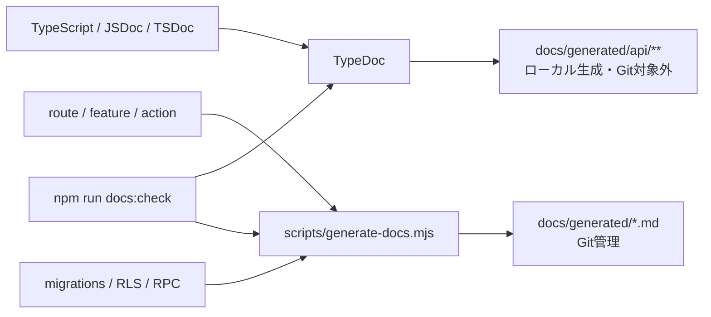

# 生成ドキュメント

詳細な運用は [開発者向けドキュメント生成](../../DocumentationGeneration.md) を参照してください。

## 構成



## 生成物

| 生成物                   | 用途                                  | 編集                           |
| ------------------------ | ------------------------------------- | ------------------------------ |
| `ImplementationGuide.md` | route、feature、Server Actionの入口   | 手編集禁止                     |
| `TechnicalReference.md`  | migration、table、RLS、functionの索引 | 手編集禁止                     |
| `CommentSuggestions.md`  | JSDoc / TSDoc追加候補のレビュー材料   | 手編集禁止。sourceへ採否を反映 |
| `generated/api/**`       | 検索可能なTypeScript HTML reference   | Git管理しない                  |

## Wikiとの違い

| Wiki                                 | Generated                      |
| ------------------------------------ | ------------------------------ |
| 要求・理由・設計意図・評価を人が管理 | 実装構造を機械的に抽出         |
| 正本を読みやすく結ぶ                 | Source / migrationの現状を示す |
| 判断・代替案・危険ケースを記録       | 業務意図を完全には説明しない   |

生成物は仕様やsecurity reviewの代替ではありません。差異がある場合は正本・実装・generatorのどこが誤っているかを確認し、生成物だけを直しません。

## 実行

```bash
npm run docs:generate
npm run docs:check
```

API HTMLを外部公開する場合は、内部path、コメント、型、秘密情報が公開可能かを別途reviewします。現状はローカル開発者向けです。
