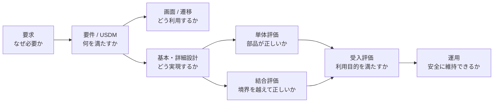

# Life Inventory Wiki

このWikiは、プロダクト要求から実装・評価・運用までを横断して調べるための入口です。現在の対象は `main` ブランチに実装済みのMVPです。未マージのLP、写真起点登録、AIによる写真解析は現行仕様へ含めません。

## 読み方

| 読みたいこと                 | 文書                                                  |
| ---------------------------- | ----------------------------------------------------- |
| 文書の優先順位・更新ルール   | [文書管理](00-governance/document-map.md)             |
| 用語の意味                   | [用語集](00-governance/glossary.md)                   |
| 要求からテストまでの対応     | [トレーサビリティ](00-governance/traceability.md)     |
| 利用者・事業上の要求         | [要求](10-product/stakeholder-requirements.md)        |
| システムが満たす要件         | [要件](10-product/system-requirements.md)             |
| USDM形式の仕様               | [USDM](10-product/usdm.md)                            |
| 利用シナリオ                 | [ユースケース](10-product/use-cases.md)               |
| 画面の目的・表示・操作       | [表示画面](20-ux/screen-catalog.md)                   |
| 画面間の移動                 | [画面遷移](20-ux/screen-flow.md)                      |
| Loading / Error / Empty等    | [UI状態設計](20-ux/ui-state-design.md)                |
| 全体構成・責務・方針         | [基本設計](30-design/basic-design.md)                 |
| 処理・依存・トランザクション | [詳細設計](30-design/detailed-design.md)              |
| データ構造                   | [データ設計](30-design/data-design.md)                |
| 認証・認可・入力防御         | [セキュリティ設計](30-design/security-design.md)      |
| 評価全体の考え方             | [評価戦略](40-quality/test-strategy.md)               |
| 関数・Schema・Component      | [単体評価](40-quality/unit-evaluation.md)             |
| DB・認証・主要導線           | [結合評価](40-quality/integration-evaluation.md)      |
| 手動受入                     | [受入評価](40-quality/acceptance-evaluation.md)       |
| 開発環境と品質ゲート         | [開発ガイド](50-operations/development-guide.md)      |
| 配備・障害時の確認           | [デプロイ・運用](50-operations/deployment-runbook.md) |
| 設計判断の一覧               | [ADR一覧](60-reference/adr-index.md)                  |
| 自動生成資料の扱い           | [生成ドキュメント](60-reference/generated-docs.md)    |

## ステータス

| 表記       | 意味                       |
| ---------- | -------------------------- |
| Accepted   | 現行仕様または採用済み設計 |
| Proposed   | 合意・実装前の提案         |
| Deferred   | MVP後へ延期                |
| Superseded | 後続文書で置換済み         |

WikiにProposedを追加する場合は、Acceptedと同じ表に混ぜず、実装済みと誤認できない表示にします。
